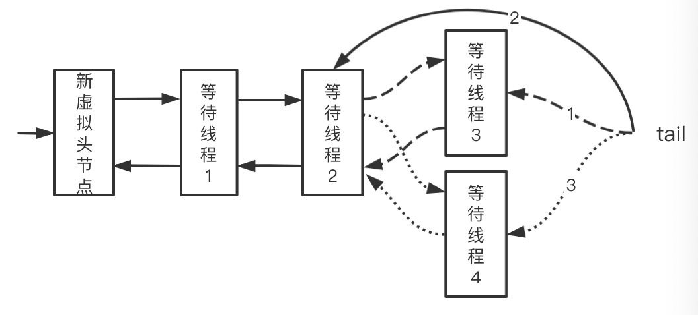

## AQS介绍 

原理

AQS核心思想是，如果被请求的共享资源空闲，那么就将请求资源的线程设置为有效的工作线程，将共享资源设置为锁定状态；如果共享资源被占用，就需要一定的阻塞等待唤醒机制来保证锁分配。


1. 如何表示共享资源的空闲状态
2. 如何有效阻塞等待线程和唤醒

## 2. AQS数据结构

使用volatile的int类型的成员变量来表示同步状态，通过CAS完成对State值的修改。

### 2.1 同步状态State

AQS中维护了一个名为state的字段，意为同步状态，是由Volatile修饰的，用于展示当前临界资源的获锁情况。

| 方法名                                                       | 描述                 |
| ------------------------------------------------------------ | -------------------- |
| protected final int getState()                               | 获取State的值        |
| protected final void setState(int newState)                  | 设置State的值        |
| protected final boolean compareAndSetState(int expect, int update) | 使用CAS方式更新State |

### 2.2 等待线程队列

AQS中的队列是CLH变体的虚拟双向队列（FIFO），AQS是通过将每条请求共享资源的线程封装成一个节点来实现锁的分配。使用CLH：Craig、Landin and Hagersten队列，是单向链表。

先来看下AQS中最基本的数据结构——Node，Node即为上面CLH变体队列中的节点。这个机制主要用的是CLH队列的变体实现的，将暂时获取不到锁的线程加入到队列中。

属性和方法

| 方法和属性值 | 含义                                                     |
| ------------ | -------------------------------------------------------- |
| waitStatus   | 当前节点在队列中的状态                                   |
| thread       | 表示处于该节点的线程                                     |
| prev         | 前驱节点指针                                             |
| nextWaiter   | 指向下一个处于CONDITION状态的节点（Condition Queue队列） |
| next         | 后继节点指针                                             |

线程两种锁的模式：

| 模式      | 含义                       |
| --------- | -------------------------- |
| SHARED    | 表示线程以共享的模式等待锁 |
| EXCLUSIVE | 表示线程以独占的模式等待锁 |

waitStatus有下面几个枚举值：

| 模式          | 含义                                     |
| ------------- | ---------------------------------------- |
| 0             | 当一个Node被初始化的时候的默认值         |
| 1，CANCELLED  | 表示线程获取锁的请求已经取消了           |
| -1，SIGNAL    | 表示后继节点的线程需要被唤醒             |
| -2，CONDITION | 表示节点在等待队列中，节点线程等待唤醒   |
| -3，PROPAGATE | 当前线程处在SHARED情况下，该字段才会使用 |

### 2.3 通过ReentrantLock理解AQS

ReentrantLock中公平锁和非公平锁在底层是相同的，这里以非公平锁为例进行分析。

在非公平锁中，有一段这样的代码：

```java
// java.util.concurrent.locks.ReentrantLock

static final class NonfairSync extends Sync {
  	...
				/**
         * Performs lock.  Try immediate barge, backing up to normal
         * acquire on failure.
         */
        final void lock() {
            if (compareAndSetState(0, 1))
                setExclusiveOwnerThread(Thread.currentThread());
            else
                acquire(1);
        }
    ...
}
```

看一下这个Acquire是怎么写的：

```java
// java.util.concurrent.locks.AbstractQueuedSynchronizer

public final void acquire(int arg) {
	if (!tryAcquire(arg) && acquireQueued(addWaiter(Node.EXCLUSIVE), arg))
		selfInterrupt();
}
```

再看一下tryAcquire方法：

```java
// java.util.concurrent.locks.AbstractQueuedSynchronizer

protected boolean tryAcquire(int arg) {
	throw new UnsupportedOperationException();
}
```

可以看出，这里只是AQS的简单实现，具体获取锁的实现方法是由各自的公平锁和非公平锁单独实现的（以ReentrantLock为例）。如果该方法返回了True，则说明当前线程获取锁成功，就不用往后执行了；如果获取失败，就需要加入到等待队列中。下面会详细解释线程是何时以及怎样被加入进等待队列中的。

|                  |                  |                                         |
| ---------------- | ---------------- | --------------------------------------- |
| acquire(int arg) | 独占模式忽略中断 | tryAcquire(int arg)通过管理是否需要锁定 |
|                  |                  |                                         |
|                  |                  |                                         |

## 3. 加锁详细过程

### 3.1 线程加入等待队列

线程执行Acquire(1)时，会通过tryAcquire获取锁。在这种情况下，如果尝试获取锁失败，就会调用addWaiter加入到等待队列中去。为了操作简单，队列中会存在虚拟的头节点。


具体实现方法如下：

```java
private Node addWaiter(Node mode) {
  // 根据当前线程和锁模式新建一个节点
  Node node = new Node(Thread.currentThread(), mode);
  // 快速尝试入队列，失败的话就自旋尾插到队列
  Node pred = tail;
  if (pred != null) {
    node.prev = pred;
    if (compareAndSetTail(pred, node)) {
      pred.next = node;
      return node;
    }
  }
  enq(node);
  return node;
}
```

下面是无锁队列的入队列操作的实现：

```java
private Node enq(final Node node) {
    for (;;) {
        Node t = tail;
        if (t == null) {
          	// 当还没有等待线程时，初始化一个虚拟的头节点
            if (compareAndSetHead(new Node()))
                tail = head;
        } else {
          	// 对应图中的1阶段
            node.prev = t;
          	// 对应图中的2阶段，此阶段只保证以tail为头节点的单链表入队列的原子性
            if (compareAndSetTail(t, node)) {
              	// 对应图中的3阶段，此处会出现以head为头节点的单链表短暂不一致的情况
                t.next = node;
                return t;
            }
        }
    }
}
```

hasQueuedPredecessors是公平锁加锁时判断等待队列中是否存在有效节点的方法。如果返回False，说明当前线程可以争取共享资源；如果返回True，说明队列中存在有效节点，当前线程必须加入到等待队列中。

```java
public final boolean hasQueuedPredecessors() {
	// The correctness of this depends on head being initialized
	// before tail and on head.next being accurate if the current
	// thread is first in queue.
	Node t = tail; // Read fields in reverse initialization order
	Node h = head;
	Node s;
	return h != t && ((s = h.next) == null || s.thread != Thread.currentThread());
}
```

线程加入等待队列之后需要考虑：

1. 当前线程是运行或者阻塞？
2. 运行线程被中断或者阻塞中的线程超时后怎么处理，怎么从队列中移除？
3. 阻塞线程何时被唤醒？

### 3.2 等待线程出队列

线程进入等待队列中，进行自旋操作，判断其前驱节点是否为头节点，是头节点则尝试获取锁，获取失败继续阻塞，否则从队列中移除线程，当前节点成为新的虚拟头节点。

#### 3.2.1 获取锁成功

以 acquireQueued 为例：


```java
final boolean acquireQueued(final Node node, int arg) {
  boolean failed = true;
  try {
    boolean interrupted = false;
    // 自旋，若是前驱节点是头节点，则尝试获取锁，否则阻塞
    for (;;) {
      // 获取当前节点的前驱节点
      final Node p = node.predecessor();
      // 如果p是头结点，就尝试获取锁
      if (p == head && tryAcquire(arg)) {
        // 获取锁成功，不需要原子操作，只有获取锁成功的才会执行
        setHead(node);
        p.next = null; // help GC
        failed = false;
        return interrupted;
      }
      // 如果p不是头结点，判断当前node是否要被阻塞，防止无限循环浪费cpu资源
      if (shouldParkAfterFailedAcquire(p, node) &&
          parkAndCheckInterrupt())
        interrupted = true;
    }
  } finally {
    // tryAcquire执行抛出异常的话，会将这个节点cancel掉
    if (failed)
      cancelAcquire(node);
  }
}

private void setHead(Node node) {
	head = node;
	node.thread = null;
	node.prev = null;
}

// 挂起当前线程，阻塞线程并返回当前线程的中断状态。
private final boolean parkAndCheckInterrupt() {
    LockSupport.park(this);
    return Thread.interrupted();
}
```

当前线程在何种情况下会阻塞：

```java
private static boolean shouldParkAfterFailedAcquire(Node pred, Node node) {
	// 获取前驱结点的节点状态
	int ws = pred.waitStatus;
	// 该节点已经设置了让前驱节点唤醒，继续阻塞
	if (ws == Node.SIGNAL)
		return true; 
	// cancelled状态
	if (ws > 0) {
    // 把cancelled节点从队列中移除
		do {
			node.prev = pred = pred.prev;
		} while (pred.waitStatus > 0);
		pred.next = node;
	} else {
		// 设置前任节点等待状态为SIGNAL，若此时前驱节点是cancelled，重新循环
		compareAndSetWaitStatus(pred, ws, Node.SIGNAL);
	}
	return false;
}
```

#### 3.2.2 取消等待线程

加入队列后尝试获取锁失败，等待超时或中断，会将这个节点cancel掉。

cancel节点会向前遍历找到第一个非cancelled节点，并找到这个节点的后继节点：

```java
if (node == null)
    return;

node.thread = null;

// 跳过 cancelled 节点
Node pred = node.prev;
while (pred.waitStatus > 0)
    node.prev = pred = pred.prev;

// 找出当前节点前第一个非cancelled节点的后继节点
Node predNext = pred.next;

// 这里可以不需要cas操作，设置完之后，其他线程会跳过该节点
node.waitStatus = Node.CANCELLED;
```

1. 若当前节点是尾节点



代码如下：

```java
// 若是尾节点，则删除自身，假设当前状态处于1的状态：
// 若cas尾节点成功，此时处于2的状态，继续设置后继节点，若没有其他等待线程进入的情况下，后继节点为null，反之则出现3的状态；
// 若cas尾节点失败，进入另一个分支；
if (node == tail && compareAndSetTail(node, pred)) {
  // ？？？？？会有3的情况，但是线程2的next为null的情况吗
  compareAndSetNext(pred, predNext, null);
} else {
  // 省略
}
```

2. 若当前节点是中间节点

```java
int ws;
if (pred != head &&
    ((ws = pred.waitStatus) == Node.SIGNAL ||
     (ws <= 0 && compareAndSetWaitStatus(pred, ws, Node.SIGNAL))) &&
    pred.thread != null) {
  Node next = node.next;
  if (next != null && next.waitStatus <= 0)
    compareAndSetNext(pred, predNext, next);
} else {
  unparkSuccessor(node);
}

node.next = node; // help GC
```

3. 头节点

```java
private void unparkSuccessor(Node node) {
  // 清理状态
  int ws = node.waitStatus;
  if (ws < 0)
    compareAndSetWaitStatus(node, ws, 0);

  // 找到当前节点的后继节点，若为空或者被cancel，从tail节点开始遍历，找到一个非cancelled节点唤醒
  Node s = node.next;
  if (s == null || s.waitStatus > 0) {
    s = null;
    for (Node t = tail; t != null && t != node; t = t.prev)
      if (t.waitStatus <= 0)
        s = t;
  }
  if (s != null)
    LockSupport.unpark(s.thread);
}
```


