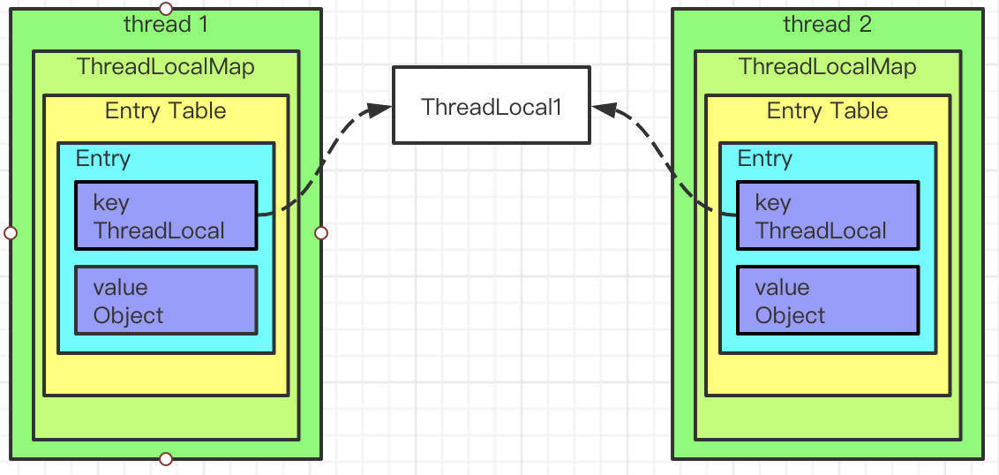

ThreadLoal 变量，它的基本原理是，同一个 ThreadLocal 所包含的对象（对ThreadLocal< String >而言即为 String 类型变量），在不同的 Thread 中有不同的副本（实际是不同的实例）。这里有几点需要注意

- 因为每个 Thread 内有自己的实例副本，且该副本只能由当前 Thread 使用。这是也是 ThreadLocal 命名的由来
- 既然每个 Thread 有自己的实例副本，且其它 Thread 不可访问，那就不存在多线程间共享的问题
- 既无共享，何来同步问题，又何来解决同步问题一说？

InheritableThreadLocal

用途

ThreadLocal归纳下来就2类用途：

- 保存线程上下文信息，在任意需要的地方可以获取！！！
- 线程安全的，避免某些情况需要考虑线程安全必须同步带来的性能损失！！！

由于ThreadLocal的特性，同一线程在某地方进行设置，在随后的任意地方都可以获取到。从而可以用来保存线程上下文信息。

常用的比如每个请求怎么把一串后续关联起来，就可以用ThreadLocal进行set，在后续的任意需要记录日志的方法里面进行get获取到请求id，从而把整个请求串起来。

还有比如Spring的事务管理，用ThreadLocal存储Connection，从而各个DAO可以获取同一Connection，可以进行事务回滚，提交等操作。


ThreadLocal为解决多线程程序的并发问题提供了一种新的思路。

每个线程往ThreadLocal中读写数据是线程隔离，互相之间不会影响的，所以ThreadLocal无法解决共享对象的更新问题！

```java
private static final ThreadLocal<DateFormat> df = ThreadLocal.withInitial(() -> new SimpleDateFormat("yyyy-MM-dd"));
```


## 实现原理

### 原理图



Thread ThreadLocalMap ThreadLocal value

```java
// Thread.java
/* ThreadLocal values pertaining to this thread. This map is maintained
     * by the ThreadLocal class. */
ThreadLocal.ThreadLocalMap threadLocals = null;

/*
     * InheritableThreadLocal values pertaining to this thread. This map is
     * maintained by the InheritableThreadLocal class.
     */
ThreadLocal.ThreadLocalMap inheritableThreadLocals = null;
```

一个ThreadLocal只能存储一个Object对象，如果需要存储多个Object对象那么就需要多个ThreadLocal

### ThreadLocalMap

和HashMap类似

散列函数

```java
// ThreadLocal.java

// 当前ThreadLocal实例的哈希值
private final int threadLocalHashCode = nextHashCode();

private static AtomicInteger nextHashCode =
  new AtomicInteger();

private static final int HASH_INCREMENT = 0x61c88647;

// 每个ThreadLocal实例通过这个调用方法生成threadLocalHashCode
private static int nextHashCode() {
  return nextHashCode.getAndAdd(HASH_INCREMENT);
}
```

数据机构

```java
static class ThreadLocalMap {

  // key 类型
  static class Entry extends WeakReference<ThreadLocal<?>> {
    /** The value associated with this ThreadLocal. */
    Object value;

    Entry(ThreadLocal<?> k, Object v) {
      super(k);
      value = v;
    }
  }

  /**
  * 初始大小.
  */
  private static final int INITIAL_CAPACITY = 16;

  /**
  * Entry Table
  * 大小必须是2的倍数.
  */
  private Entry[] table;

  /**
  * 当前Entry Table的中的Entry数量
  */
  private int size = 0;

  /**
  * 扩容的阈值
  */
  private int threshold; // Default to 0
  
  // 省略方法
}
```


冲突解决

开放地址法

```java
public T get() {
  Thread t = Thread.currentThread();
  ThreadLocalMap map = getMap(t);
  if (map != null) {
    ThreadLocalMap.Entry e = map.getEntry(this);
    if (e != null) {
      @SuppressWarnings("unchecked")
      T result = (T)e.value;
      return result;
    }
  }
  return setInitialValue();
}

private Entry getEntry(ThreadLocal<?> key) {
  int i = key.threadLocalHashCode & (table.length - 1);
  Entry e = table[i];
  if (e != null && e.get() == key)
    return e;
  else
    return getEntryAfterMiss(key, i, e);
}

private Entry getEntryAfterMiss(ThreadLocal<?> key, int i, Entry e) {
  Entry[] tab = table;
  int len = tab.length;

  while (e != null) {
    ThreadLocal<?> k = e.get();
    if (k == key)
      return e;
    if (k == null)
      // 这里会清理一下key被gc回收掉的entry
      expungeStaleEntry(i);
    else
      // 开放地址法寻找下一个index
      i = nextIndex(i, len);
    e = tab[i];
  }
  return null;
}

private static int nextIndex(int i, int len) {
  return ((i + 1 < len) ? i + 1 : 0);
}
```


当发现entry不为null，但是key为null时，会清理

```java
// staleSlot是key为null的entry的下标
private int expungeStaleEntry(int staleSlot) {
  Entry[] tab = table;
  int len = tab.length;

  // 清理
  tab[staleSlot].value = null;
  tab[staleSlot] = null;
  size--;

  // Rehash until we encounter null
  Entry e;
  int i;
  // 向后遍历，直到一个entry为null的位置
  for (i = nextIndex(staleSlot, len);
       (e = tab[i]) != null;
       i = nextIndex(i, len)) {
    ThreadLocal<?> k = e.get();
    // 清理
    if (k == null) {
      e.value = null;
      tab[i] = null;
      size--;
    // 当key不为null时，rehash，如果是冲突后调整的位置，调整到最近的位置
    } else {
      int h = k.threadLocalHashCode & (len - 1);
      if (h != i) {
        tab[i] = null;

        // Unlike Knuth 6.4 Algorithm R, we must scan until
        // null because multiple entries could have been stale.
        while (tab[h] != null)
          h = nextIndex(h, len);
        tab[h] = e;
      }
    }
  }
  return i;
}
```


```java
// 当setValue发现，key哈希后对应的entry不为null，但是key为null时
private void replaceStaleEntry(ThreadLocal<?> key, Object value,
                                       int staleSlot) {
  Entry[] tab = table;
  int len = tab.length;
  Entry e;

  // Back up to check for prior stale entry in current run.
  // We clean out whole runs at a time to avoid continual
  // incremental rehashing due to garbage collector freeing
  // up refs in bunches (i.e., whenever the collector runs).
  int slotToExpunge = staleSlot;
  for (int i = prevIndex(staleSlot, len);
       (e = tab[i]) != null;
       i = prevIndex(i, len))
    if (e.get() == null)
      slotToExpunge = i;

  //向后遍历
  for (int i = nextIndex(staleSlot, len);
       (e = tab[i]) != null;
       i = nextIndex(i, len)) {
    ThreadLocal<?> k = e.get();

    // key 存在，将i位置的entry和之前key为null的staleSlot位置的entry交换
    if (k == key) {
      e.value = value;

      tab[i] = tab[staleSlot];
      tab[staleSlot] = e;

      // Start expunge at preceding stale entry if it exists
      if (slotToExpunge == staleSlot)
        slotToExpunge = i;
      cleanSomeSlots(expungeStaleEntry(slotToExpunge), len);
      return;
    }

    // If we didn't find stale entry on backward scan, the
    // first stale entry seen while scanning for key is the
    // first still present in the run.
    if (k == null && slotToExpunge == staleSlot)
      slotToExpunge = i;
  }

  // key不存在, 在stale slot位置创建新的entry
  tab[staleSlot].value = null;
  tab[staleSlot] = new Entry(key, value);

  // If there are any other stale entries in run, expunge them
  if (slotToExpunge != staleSlot)
    // 随机清理log2n次，如果没有需要清理的则退出
    cleanSomeSlots(expungeStaleEntry(slotToExpunge), len);
}
```


扩容

```java
private void setThreshold(int len) {
  threshold = len * 2 / 3;
}
```


内存泄漏

