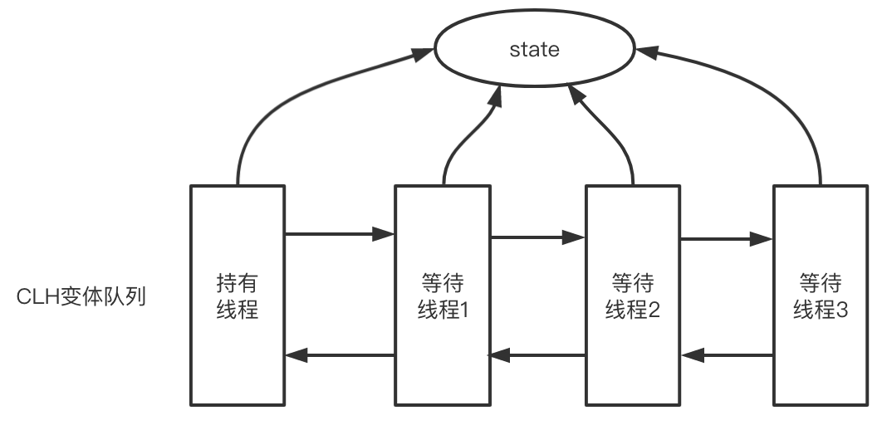
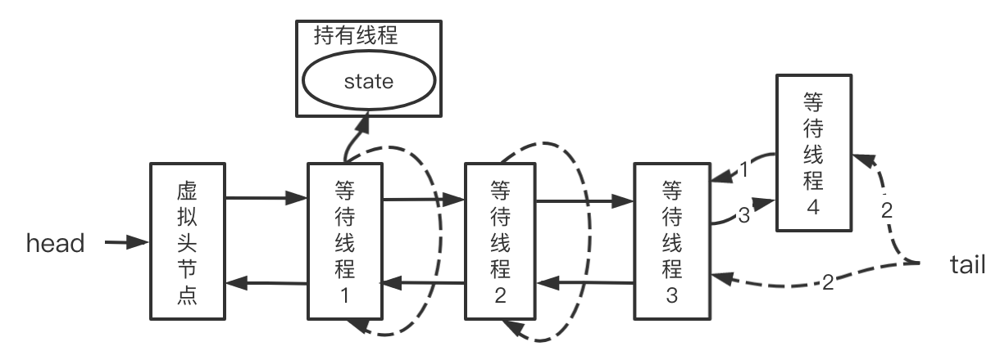
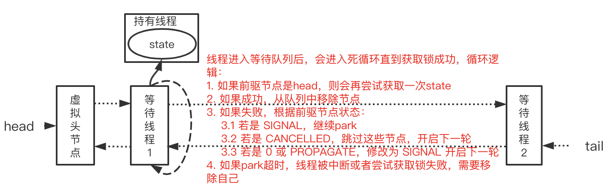
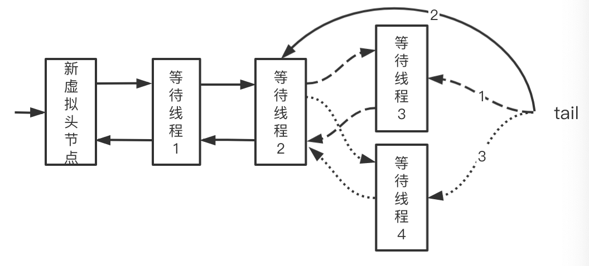

[toc]

# AQS介绍 

## 1. 原理

AQS核心思想是：用户线程在用户空间通过cas操作先尝试获取锁，若获取失败，则加入到等待队列中（也就是尽可能晚的调用park 进入到内核空间），等待唤醒。若获取成功则接下去执行。



ReentrankLock 和 Synchronized 比较：

|            | ReentrankLock                  | Synchronized   |
| ---------- | ------------------------------ | -------------- |
| 锁机制实现 | AQS                            | 监视器模式     |
| 灵活性     | 支持响应中断，超时，尝试获取锁 | 不灵活         |
| 释放形式   | 必须显式调用unlock释放锁       | 自动释放监视器 |
| 锁类型     | 公平锁和非公平锁都有实现       | 非公平锁       |
| 条件队列   | 可关联多个条件队列             | 关联一个       |
| 可重入性   | 可重入                         | 可重入         |

## 2. AQS数据结构

使用 volatile 的 int 类型的成员变量来表示同步状态，通过 CAS 完成对 state 值的修改。

### 2.1 同步状态State

AQS中维护了一个名为state的字段，意为同步状态，是由volatile修饰的，用于展示当前临界资源的获锁情况。

| 方法名                                                       | 描述                 |
| ------------------------------------------------------------ | -------------------- |
| protected final int getState()                               | 获取State的值        |
| protected final void setState(int newState)                  | 设置State的值        |
| protected final boolean compareAndSetState(int expect, int update) | 使用CAS方式更新State |

### 2.2 等待线程队列

AQS中的队列是CLH变体（CLH：Craig、Landin and Hagersten队列，是单向链表）的虚拟双向队列（FIFO），AQS是通过将每条请求共享资源的线程封装成一个节点来实现锁的分配。先来看下AQS中最基本的数据结构——Node，Node即为上面CLH变体队列中的节点。

属性

| 属性       | 含义                                                     |
| ---------- | -------------------------------------------------------- |
| waitStatus | 当前节点在队列中的状态                                   |
| thread     | 表示处于该节点的线程                                     |
| prev       | 前驱节点指针                                             |
| nextWaiter | 指向下一个处于CONDITION状态的节点（Condition Queue队列） |
| next       | 后继节点指针                                             |

线程两种锁的模式：

| 模式      | 含义                       |
| --------- | -------------------------- |
| SHARED    | 表示线程以共享的模式等待锁 |
| EXCLUSIVE | 表示线程以独占的模式等待锁 |

waitStatus有下面几个枚举值：

| 模式          | 含义                                                         |
| ------------- | ------------------------------------------------------------ |
| 0             | 当一个Node被初始化的时候的默认值                             |
| 1，CANCELLED  | 表示线程获取锁的请求已经取消了，即获取锁超时，线程被中断等等 |
| -1，SIGNAL    | 表示后继节点的线程需要被唤醒                                 |
| -2，CONDITION | 表示节点在等待队列中，节点线程等待唤醒                       |
| -3，PROPAGATE | 当前线程处在SHARED情况下，该字段才会使用                     |

## 3. 源码分析

### 3.0 通过ReentrantLock理解AQS

ReentrantLock中公平锁和非公平锁在底层是相同的，这里以非公平锁为例进行分析。

在非公平锁中，有一段这样的代码：

```java
// java.util.concurrent.locks.ReentrantLock

static final class NonfairSync extends Sync {
  	...
				/**
         * Performs lock.  Try immediate barge, backing up to normal
         * acquire on failure.
         */
        final void lock() {
            if (compareAndSetState(0, 1))
                setExclusiveOwnerThread(Thread.currentThread());
            else
                acquire(1);
        }
    ...
}
```

看一下这个Acquire是怎么写的：

```java
// java.util.concurrent.locks.AbstractQueuedSynchronizer

public final void acquire(int arg) {
	if (!tryAcquire(arg) && acquireQueued(addWaiter(Node.EXCLUSIVE), arg))
		selfInterrupt();
}
```

再看一下tryAcquire方法：

```java
// java.util.concurrent.locks.AbstractQueuedSynchronizer

protected boolean tryAcquire(int arg) {
	throw new UnsupportedOperationException();
}
```

可以看出，这里只是AQS的简单实现，具体获取锁的实现方法是由各自的公平锁和非公平锁单独实现的（以ReentrantLock为例）。如果该方法返回了true，则说明当前线程获取锁成功，就不用往后执行了；如果获取失败，就需要加入到等待队列中。下面是各个模式下 AQS 在用户空间提供的抽象方法：

| 模式     | 获取方法         | 释放方法         |
| -------- | ---------------- | ---------------- |
| 独占模式 | tryAcquire       | tryRelease       |
| 共享模式 | tryAcquireShared | tryReleaseShared |

### 3.1 线程加入等待队列

上面我们分析了线程获取锁时，会先通过tryAcquire在获取空间尝试获取。在这种情况下，如果尝试获取锁失败，就会调用addWaiter加入到等待队列中去。为了操作简单，队列中会存在虚拟的头节点。



具体实现方法如下：

```java
private Node addWaiter(Node mode) {
  // 根据当前线程和锁模式新建一个节点
  Node node = new Node(Thread.currentThread(), mode);
  // 快速尝试入队列，失败的话就自旋尾插到队列
  // 技巧：尽可能晚的自旋
  Node pred = tail;
  if (pred != null) {
    node.prev = pred;
    if (compareAndSetTail(pred, node)) {
      pred.next = node;
      return node;
    }
  }
  enq(node);
  return node;
}
```

下面是无锁队列的入队列操作的实现：

```java
private Node enq(final Node node) {
    for (;;) {
        Node t = tail;
        if (t == null) {
          	// 当还没有等待线程时，初始化一个虚拟的头节点
          	// 多个线程可能同时初始化这个链表，这里用cas
            if (compareAndSetHead(new Node()))
                tail = head;
        } else {
          	// 对应图中的1阶段
            node.prev = t;
          	// 对应图中的2阶段，此阶段只保证以tail为头节点的单链表入队列的原子性
            if (compareAndSetTail(t, node)) {
              	// 对应图中的3阶段，此处会出现以head为头节点的单链表短暂不一致的情况
                t.next = node;
                return t;
            }
        }
    }
}
```

hasQueuedPredecessors是公平锁加锁时判断等待队列中是否存在有效节点的方法。如果返回false，说明当前线程可以争取共享资源；如果返回true，说明队列中存在有效节点，当前线程必须加入到等待队列中。

```java
public final boolean hasQueuedPredecessors() {
	// The correctness of this depends on head being initialized
	// before tail and on head.next being accurate if the current
	// thread is first in queue.
	Node t = tail; // Read fields in reverse initialization order
	Node h = head;
	Node s;
	return h != t && ((s = h.next) == null || s.thread != Thread.currentThread());
}
```

### 3.2 等待线程出队列

加入到等待队列中的节点，会进入一段死循环中，逻辑如下：



也就是线程在达到下面两个条件时才会出队列：

1. 获取锁成功
2. 等待锁超时，线程被中断或者尝试获取失败

#### 3.2.1 获取锁成功

以 acquireQueued 为例：

```java
final boolean acquireQueued(final Node node, int arg) {
  boolean failed = true;
  try {
    boolean interrupted = false;
    // 自旋，若是前驱节点是头节点，则尝试获取锁，否则阻塞
    for (;;) {
      // 获取当前节点的前驱节点
      final Node p = node.predecessor();
      // 如果p是头结点，就尝试获取锁
      if (p == head && tryAcquire(arg)) {
        // 获取锁成功，如下图所示，不需要原子操作，只有获取锁成功的才会执行
        setHead(node);
        p.next = null; // help GC
        failed = false;
        return interrupted;
      }
      // 如果p不是头结点，判断当前node是否要被阻塞，防止无限循环浪费cpu资源
      if (shouldParkAfterFailedAcquire(p, node) &&
          parkAndCheckInterrupt())
        interrupted = true;
    }
  } finally {
    // tryAcquire执行抛出异常的话，会将这个节点cancel掉
    if (failed)
      cancelAcquire(node);
  }
}

private void setHead(Node node) {
	head = node;
	node.thread = null;
	node.prev = null;
}

// 挂起当前线程，阻塞线程并返回当前线程的中断状态。
private final boolean parkAndCheckInterrupt() {
    LockSupport.park(this);
    return Thread.interrupted();
}
```

前驱节点不是头节点时：

```java
private static boolean shouldParkAfterFailedAcquire(Node pred, Node node) {
	// 获取前驱结点的节点状态
	int ws = pred.waitStatus;
	// 该节点已经设置了让前驱节点唤醒，继续阻塞
	if (ws == Node.SIGNAL)
		return true; 
	// cancelled状态直接从等待队列中移除
	if (ws > 0) {
		do {
			node.prev = pred = pred.prev;
		} while (pred.waitStatus > 0);
		pred.next = node;
	} else {
		// waitStatus 必须是 0 或者 PROPAGATE
    // 可能和头节点并发，若 cas 失败，重新判断前驱节点状态
		compareAndSetWaitStatus(pred, ws, Node.SIGNAL);
	}
	return false;
}
```

#### 3.2.2 取消等待线程

在 acquireQueued 有这样一段代码，加入队列后节点尝试获取锁失败，等待超时或中断，会将这个节点cancel掉。

```java
if (failed)
  cancelAcquire(node);
```

cancel节点会向前遍历找到第一个非cancelled节点，并找到这个节点的后继节点，cancel节点的过程中，从tail开始的这个队列是不会断开的，会保持完整性：

```java
private void cancelAcquire(Node node) {
  if (node == null)
      return;

  node.thread = null;

  // 跳过 cancelled 节点
  Node pred = node.prev;
  while (pred.waitStatus > 0)
      node.prev = pred = pred.prev;

  // 找出当前节点前第一个非cancelled节点的后继节点
  Node predNext = pred.next;

  // 这里可以不需要cas操作，设置完之后，其他线程会跳过该节点
  node.waitStatus = Node.CANCELLED;
}
```

1. 若当前节点是尾节点



代码如下：

```java
// 若是尾节点，则删除自身，假设当前状态处于1的状态：
// 若cas尾节点成功，此时处于2的状态，继续设置后继节点，若没有其他等待线程进入的情况下，后继节点为null，反之则出现3的状态；
// 若cas尾节点失败，进入另一个分支；
if (node == tail && compareAndSetTail(node, pred)) {
  compareAndSetNext(pred, predNext, null);
} else {
  // 若当前节点是中间节点的情况，见下
}
```

2. 若当前节点是中间节点

```java
int ws;
if (pred != head &&
    ((ws = pred.waitStatus) == Node.SIGNAL ||
     (ws <= 0 && compareAndSetWaitStatus(pred, ws, Node.SIGNAL))) &&
    pred.thread != null) {
  Node next = node.next;
  if (next != null && next.waitStatus <= 0)
    compareAndSetNext(pred, predNext, next);
} else {
  unparkSuccessor(node);
}

node.next = node; // help GC
```

3. 头节点

```java
private void unparkSuccessor(Node node) {
  // 清理状态
  int ws = node.waitStatus;
  if (ws < 0)
    compareAndSetWaitStatus(node, ws, 0);

  // 找到当前节点的后继节点，若为空或者被cancel，从tail节点开始遍历，找到一个非cancelled节点唤醒
  Node s = node.next;
  if (s == null || s.waitStatus > 0) {
    s = null;
    for (Node t = tail; t != null && t != node; t = t.prev)
      if (t.waitStatus <= 0)
        s = t;
  }
  if (s != null)
    LockSupport.unpark(s.thread);
}
```


释放锁

```java
public final boolean release(int arg) {
  if (tryRelease(arg)) {
    Node h = head;
    // 只有存在头节点并且头节点设置了需要让前驱节点唤醒，才会调用park
    if (h != null && h.waitStatus != 0)
      unparkSuccessor(h);
    return true;
  }
  return false;
}
```

### 3.3. Condition实现原理

Condition 是在 java 1.5 中才出现的，它用来替代传统的 Object 的 wait() 、notify() 实现线程间的协作，相比使用 Object的 wait()、notify()，使用 Condition 中的 await()、signal() 这种方式实现线程间协作更加安全和高效。因此通常来说比较推荐使用 Condition，其中 AbstractQueueSynchronizer 中实现了 Condition 中的方法，主要对外提供 awaite(Object.wait())和 signal(Object.notify()) 调用。

```java
public final void await() throws InterruptedException {
    if (Thread.interrupted())
        throw new InterruptedException();
  	// 用当前线程创建一个Node节点，waitStatus为CONDITION
    Node node = addConditionWaiter();
  	// 释放该节点的锁
    int savedState = fullyRelease(node);
    int interruptMode = 0;
  	// 判断当前线程是否在等待队列中，不在则阻塞
    while (!isOnSyncQueue(node)) {
        LockSupport.park(this);
        if ((interruptMode = checkInterruptWhileWaiting(node)) != 0)
            break;
    }
  	
  	// 将节点放入到等待队列之后，和前面讲的一致，获取锁等等
    if (acquireQueued(node, savedState) && interruptMode != THROW_IE)
        interruptMode = REINTERRUPT;
    if (node.nextWaiter != null) // clean up if cancelled
        unlinkCancelledWaiters();
    if (interruptMode != 0)
        reportInterruptAfterWait(interruptMode);
}
```

```java
private void doSignal(Node first) {
    do {
        if ( (firstWaiter = first.nextWaiter) == null)
            lastWaiter = null;
        first.nextWaiter = null;
    } while (!transferForSignal(first) &&
             (first = firstWaiter) != null);
}
// 调用signal 之后，则会把该条件队列的第一个节点放到等待队列中
final boolean transferForSignal(Node node) {
    if (!compareAndSetWaitStatus(node, Node.CONDITION, 0))
        return false;

    Node p = enq(node);
    int ws = p.waitStatus;
    if (ws > 0 || !compareAndSetWaitStatus(p, ws, Node.SIGNAL))
        LockSupport.unpark(node.thread);
    return true;
}
```


#### Condition总结

我们总结下 Condition 和 wait/notify 的比较：

- Condition 可以精准的对多个不同条件进行控制，wait/notify 只能和 synchronized 关键字一起使用，并且只能唤醒一个或者全部的等待队列；
- Condition 需要使用 Lock 进行控制，使用的时候要注意 lock() 后及时的 unlock()，Condition 有类似于 await 的机制，因此不会产生加锁方式而产生的死锁出现，同时底层实现的是 park/unpark 的机制，因此也不会产生先唤醒再挂起的死锁，一句话就是不会产生死锁，但是 wait/notify 会产生先唤醒再挂起的死锁。