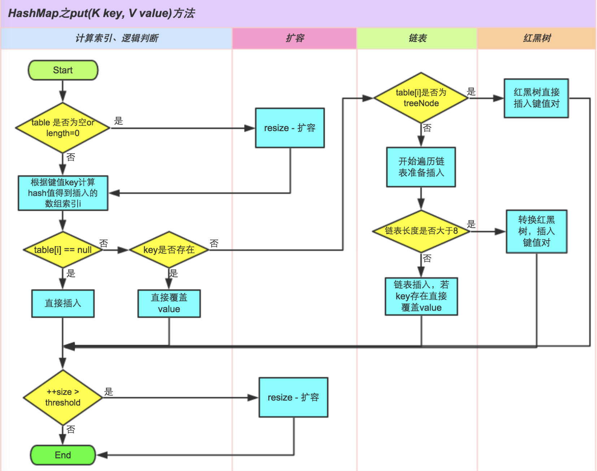

#HashMap

HashMap是Java程序员使用频率最高的用于映射（键值对）处理的数据类型。随着JDK（Java Developmet Kit）版本的更新，JDK1.8对HashMap底层的实现进行了优化，例如引入红黑树的数据结构和扩容的优化等。本文结合JDK1.7和JDK1.8的区别，深入探讨HashMap的结构实现和功能原理。

java中的类继承结构

## 1. 实现

### 1.1 散列函数

1. 取key的hashCode值

   ```java
   static final int hash(Object key) {
     int h;
     // 可以看出 HashMap 中 可以存储 null 元素
     return (key == null) ? 0 : (h = key.hashCode()) ^ (h >>> 16);
   }
   ```

2. 高位运算

   主要是从速度、功效、质量来考虑的，这么做可以在数组table的length比较小的时候，也能保证考虑到高低Bit都参与到Hash的计算中，同时不会有太大的开销。

3. 取模运算

   ```java
   tab[(n - 1) & hash]
   ```

   其中的n是HashMap底层数组的长度，这个长度总是2的m次方，这是HashMap在速度上的优化。当n总是2的m次方时，h& (length-1)运算等价于对length取模，也就是h%length，但是&比%具有更高的效率。

### 1.2 如何解决散列冲突

java中的HashMap 采用链表法解决散列冲突。

#### 1.2.1 存储结构

下面是HashMap的顶层的数据结构：

```java
// 底层的哈希桶数组
transient Node<K,V>[] table;

// 装载因子
final float loadFactor;

// 当前存储的key-value键值对的数量
transient int size;

// 能够存储的key-value键值对的总量
int threshold;

// 数组中对应的实体
static class Node<K,V> implements Map.Entry<K,V> {
  // key的哈希值，用来定位在哈希桶中的位置
  final int hash;
  final K key;
  V value;
  // HashMap 使用链表法解决哈希冲突，代表冲突的下一个键值对实体
  Node<K,V> next;

  // 省略
}
```

HashMap 的 put 流程可以通过下图来理解：



HashMap在 JDK 1.8 中的代码实现：

```java
public V put(K key, V value) {
  // 计算key的hash值
  return putVal(hash(key), key, value, false, true);
}

final V putVal(int hash, K key, V value, boolean onlyIfAbsent,
               boolean evict) {
  Node<K,V>[] tab; Node<K,V> p; int n, i;
  // tab 为空则创建
  if ((tab = table) == null || (n = tab.length) == 0)
    n = (tab = resize()).length;
  // 计算index，并判断该index上是否有值
  if ((p = tab[i = (n - 1) & hash]) == null)
    // 没有值的话，创建Node并新增
    tab[i] = newNode(hash, key, value, null);
  else {
    Node<K,V> e; K k;
    // key存在
    if (p.hash == hash &&
        ((k = p.key) == key || (key != null && key.equals(k))))
      e = p;
    // 判断该链为红黑树
    else if (p instanceof TreeNode)
      e = ((TreeNode<K,V>)p).putTreeVal(this, tab, hash, key, value);
    else {
      // 遍历链表，不存在则插入链表尾部
      for (int binCount = 0; ; ++binCount) {
        if ((e = p.next) == null) {
          // key 不存在，插入到链表尾端
          p.next = newNode(hash, key, value, null);
          // 链表数量大于8时，将链表转换为红黑树
          if (binCount >= TREEIFY_THRESHOLD - 1) // -1 for 1st
            treeifyBin(tab, hash);
          break;
        }
        if (e.hash == hash &&
            ((k = e.key) == key || (key != null && key.equals(k))))
          break;
        p = e;
      }
    }
    // 直接覆盖原值
    if (e != null) {
      V oldValue = e.value;
      if (!onlyIfAbsent || oldValue == null)
        e.value = value;
      afterNodeAccess(e);
      return oldValue;
    }
  }
  ++modCount;
  // 判断是否需要扩容
  if (++size > threshold)
    resize();
  afterNodeInsertion(evict);
  return null;
}
```

#### 1.2.2 扩容

当向HashMap对象里不断地添加元素，如果发现HashMap存储的对象超过了Load Factor 所希望的比例，那么就会发生resize。resize的过程，简单的说就是把bucket扩充为2倍，之后重新计算index，把节点再重新放到新的bucket中。

JDK 1.8 resize的源码：

```java
final Node<K,V>[] resize() {
  Node<K,V>[] oldTab = table;
  int oldCap = (oldTab == null) ? 0 : oldTab.length;
  int oldThr = threshold;
  int newCap, newThr = 0;
  if (oldCap > 0) {
    // 超过最大值就不再扩充了，就只好随你碰撞去吧
    if (oldCap >= MAXIMUM_CAPACITY) {
      threshold = Integer.MAX_VALUE;
      return oldTab;
    }
    // 没超过最大值，就扩充为原来的2倍
    else if ((newCap = oldCap << 1) < MAXIMUM_CAPACITY &&
             oldCap >= DEFAULT_INITIAL_CAPACITY)
      newThr = oldThr << 1; // double threshold
  }
  else if (oldThr > 0) // initial capacity was placed in threshold
    newCap = oldThr;
  else {               // zero initial threshold signifies using defaults
    newCap = DEFAULT_INITIAL_CAPACITY;
    newThr = (int)(DEFAULT_LOAD_FACTOR * DEFAULT_INITIAL_CAPACITY);
  }
  // 计算新的resize上限
  if (newThr == 0) {
    float ft = (float)newCap * loadFactor;
    newThr = (newCap < MAXIMUM_CAPACITY && ft < (float)MAXIMUM_CAPACITY ?
              (int)ft : Integer.MAX_VALUE);
  }
  threshold = newThr;
  @SuppressWarnings({"rawtypes","unchecked"})
  Node<K,V>[] newTab = (Node<K,V>[])new Node[newCap];
  table = newTab;
  if (oldTab != null) {
    // 遍历哈希桶里面的所有数据
    for (int j = 0; j < oldCap; ++j) {
      Node<K,V> e;
      if ((e = oldTab[j]) != null) {
        oldTab[j] = null;
        if (e.next == null)
          newTab[e.hash & (newCap - 1)] = e;
        else if (e instanceof TreeNode)
          ((TreeNode<K,V>)e).split(this, newTab, j, oldCap);
        else {
          // 对于哈希冲突的所有链表元素，可以保证顺序性：
          // 1: index保持不变
          // 2: index + 2 ^ 4
          Node<K,V> loHead = null, loTail = null;
          Node<K,V> hiHead = null, hiTail = null;
          Node<K,V> next;
          do {
            next = e.next;
            if ((e.hash & oldCap) == 0) {
              if (loTail == null)
                loHead = e;
              else
                loTail.next = e;
              loTail = e;
            }
            else {
              if (hiTail == null)
                hiHead = e;
              else
                hiTail.next = e;
              hiTail = e;
            }
          } while ((e = next) != null);
          if (loTail != null) {
            loTail.next = null;
            newTab[j] = loHead;
          }
          if (hiTail != null) {
            hiTail.next = null;
            newTab[j + oldCap] = hiHead;
          }
        }
      }
    }
  }
  return newTab;
}
```

JDK 1.8 对 resize 做了一些优化。经过观测我们可以发现：HashMap使用的是2次幂的扩展（resize之后长度扩为原来2倍），所以，元素的位置要么是在原位置，要么是在原位置再移动2次幂的位置。

怎么理解呢？例如我们从16扩展为32时，具体的变化如下所示：


因此元素在重新计算hash之后，因为n变为2倍，那么n-1的mask范围在高位多1bit(红色)，因此新的index就会发生这样的变化：


因此，我们在扩充HashMap的时候，不需要重新计算hash，只需要看看原来的hash值新增的那个bit是1还是0就好了，是0的话索引没变，是1的话索引变成“原索引+oldCap”。可以看看下图为16扩充为32的resize示意图：


这个设计确实非常的巧妙，既省去了重新计算hash值的时间，而且同时，由于新增的1bit是0还是1可以认为是随机的，因此resize的过程，均匀的把之前的冲突的节点分散到新的bucket了。

## 2 优化

resize 优化1. 头插和尾cha

哈希冲突，链表转红黑树的优化