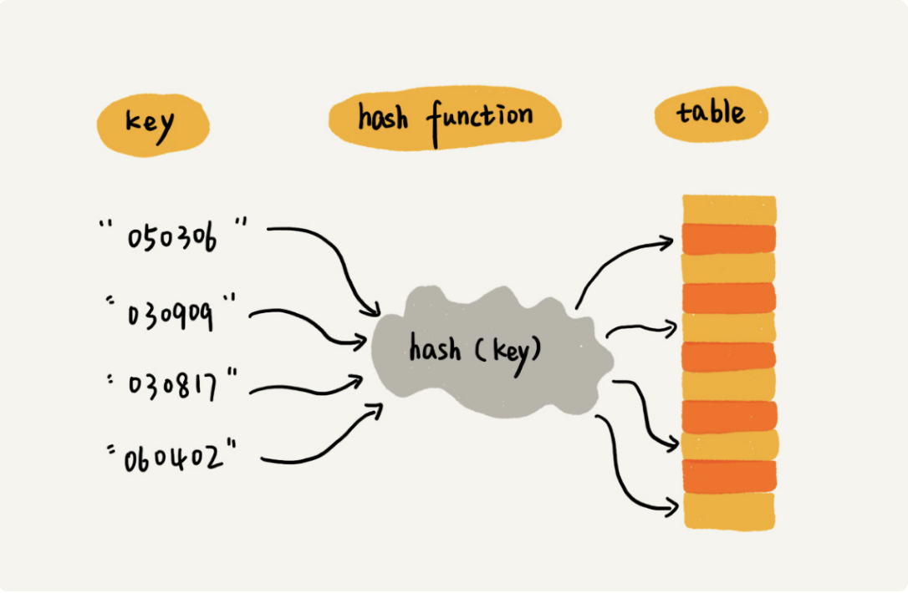
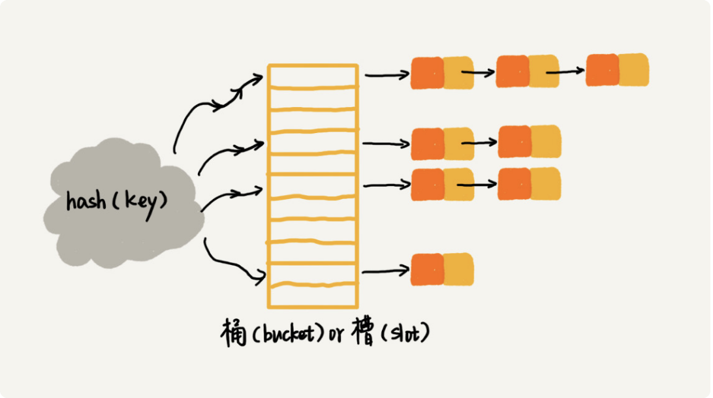

# 散列表

## 原理

散列表用的是数组按照下标随机访问时，时间复杂度是O(1)的特性。通过散列函数把元素的键值映射为下标，数据存储在数组对应的下标的位置。所以散列表其实就是数组的一种扩展，由数组演化而来。可以说，如果没有数组就没有散列表。



## 1. 散列函数

散列函数，顾名思义，它其实就是一个函数。我们可以把它定义成hash(key)，其中 key表示元素的键值，hash(key)的值表示经过散列函数计算得到的散列值。以上图为例，我们可以定义一个下面的散列函数，如下面的伪代码：

```java
int hash(String key) {
  // 获取后两位字符
  string lastTwoChars = key.substr(length-2, length);
  // 将后两位字符转换为整数
  int hashValue = convert lastTwoChas to int-type;
  return hashValue;
}
```

### 散列函数基本要求

1. 散列函数计算得到的散列值是一个非负整数，主要是数组下标是非负整数。
2. 如果key1=key2，那hash(key1) == hash(key2)。
3. 如果key1≠ key2，那 hash(key1) ≠  hash(key2)。

关于第三点，不同的key对应的散列值都不一样的散列函数几乎是不可能的。即使像业界著名的MD5，SHA，CRC等哈希算法，也无法避免这种散列冲突。因为key几乎可以认为是无限的，映射到定长的散列值不可避免会有冲突。而且，因为数组的存储空间有限，也会加大散列冲突的概率。所以我们几乎无法找到一个完美的无冲突的散列函数，即便能找到，付出的时间成本、计算成本也是很大的，所以针对散列冲突问题，我们需要通过其他途径来解决。

### 如何设计散列函数

散列函数设计的好坏，决定了散列表冲突的概率大小，也直接决定了散列表的性能。那什么才是好的散列函数呢？

1. 散列函数的设计不能太复杂。过于复杂的散列函数，势必会消耗很多计算时间，也就间接的影响到散列表的性能。
2. 散列函数生成的值要尽可能随机并且均匀分布。这样才能避免或者最小化散列冲突，而且即便出现冲突，散列到每个槽里的数据也会比较平均，不会出现某个槽内数据特别多的情况。
3. 实际工作中，我们还需要综合考虑各种因素。这些因素有关键字的长度、特点、分布、还有散列表的大小等。
4. 散列函数的设计方法还有很多，比如直接寻址法、平方取中法、折叠法、随机数法等，这些只要了解就行了，不需要全都掌握。

## 2. 散列冲突解决方法

既然散列冲突避免不了，如何解决散列冲突？

### 开放地址法

核心思想是：如果出现了散列冲突，重新探测一个空闲位置，将其插入。如何重新探测新的位置?
* 线性探测：当我们往散列表中插入数据时，如果某个数据经过散列函数散列之后，存储位置已经被占用了，我们就从当前位置开始，依次往后查找，直到找到空闲位置为止。当散列表中插入的数据越来越多时，散列冲突发生的可能性就会越来越大，空闲位置会越来越少，线性探测的时间就会越来越久。极端情况下，可能需要探测整个散列表，所以最坏情况下的时间复杂度为O(n)，同理，在删除和查找时，也有可能探测整张散列表，才能找到要查找或者删除的数据。

* 二次探测（Quadratic probing）：线性探测每次探测的步长是 1，那它探测的下标序列就是 hash(key)+0，hash(key)+1，hash(key)+2……而二次探测探测的步长就变成了原来的“二次方”，也就是说，它探测的下标序列就是 hash(key)+0，hash(key)+1^2，hash(key)+2^2……

* 双重散列（Double hashing）：不仅使用一个散列函数，使用一组散列函数hash1(key)，hash2(key)......我们先用第一个散列函数，如果计算得到的存储位置已经被占用，再用第二个散列函数，依次类推，直到找到空闲的存储位置。

使用开放地址法有个注意点就是，删除数据不能直接置空删除，需要引入deleted类似的标识位。

优缺点：

* 优点：散列表中的数据都存储在数组中，可以有效地利用 CPU 缓存加快查询速度。而且，这种方法实现的散列表，序列化起来比较简单。链表法包含指针，序列化起来就没那么容易。
* 缺点：在开放寻址法中，所有的数据都存储在一个数组中，比起链表法来说，冲突的代价更高。所以，使用开放寻址法解决冲突的散列表，装载因子的上限不能太大。这也导致这种方法比链表法更浪费内存空间。

总结：当数据量比较小、装载因子小的时候，适合采用开放寻址法。这也是 Java 中的ThreadLocalMap使用开放寻址法解决散列冲突的原因。

### 链表法

链表法是更常用简单解决办法，在散列表中，每个“桶（bucket）”或者“槽（slot）”会对应一条链表，所有散列值相同的元素我们都放到相同槽位对应的链表中。



时间复杂度

| 操                       作 | 时间复杂度                                                   |
| --------------------------- | ------------------------------------------------------------ |
| 插入                        | O(1)                                                         |
| 查找                        | 时间复杂度和链表的长度k成正比，即O(k)。对于散列比较均匀的散列函数来说，理论上讲，k=n/m，其中n表示散列表中的数据的个数,m表示散列表中槽的个数 |
| 删除                        | 同查找                                                       |

总结：基于链表的散列冲突处理方法比较适合存储大对象、大数据量的散列表，而且，比起开放寻址法，它更加灵活，支持更多的优化策略，比如用红黑树代替链表。

## 3. 动态扩容

### 装载因子

不管采用哪种解决散列冲突的方法，当散列表中的空闲位置不多的时候，散列冲突的概率就会大大提高。为了尽可能保证散列表的操作效率，一般情况下，我们尽可能保证散列表中有一定比例的空闲槽位。我们用装载因子（load factor）来表示空位的多少。装载因子越大，说明散列表中的元素越多，空闲位置越少，散列冲突的概率就越大。装载因子的计算公式：散列表的装载因子 = 填入表中的元素个数 / 散列表的长度。

对于没有频繁插入和删除的静态数据集合来说，我们很容易根据数据的特点、分布等，设计出完美的、极少冲突的散列函数，因为毕竟之前数据都是已知的。

对于动态散列表来说，数据集合是频繁变动的，我们事先无法预估将要加入的数据个数，所以我们也无法事先申请一个足够大的散列表。随着数据慢慢加入，装载因子就会慢慢变大。当装载因子大到一定程度之后，散列冲突就会变得不可接受。这个时候，我们该如何处理呢？

### 扩容

因为散列表的大小变了，数据的存储位置也变了，所以我们需要通过散列函数重新计算每个数据的存储位置。当散列表的装载因子超过某个阈值时，就需要进行扩容。装载因子阈值需要选择得当。如果太大，会导致冲突过多；如果太小，会导致内存浪费严重。装载因子阈值的设置要权衡时间、空间复杂度。如果内存空间不紧张，对执行效率要求很高，可以降低负载因子的阈值；相反，如果内存空间紧张，对执行效率要求又不高，可以增加负载因子的值，甚至可以大于 1。