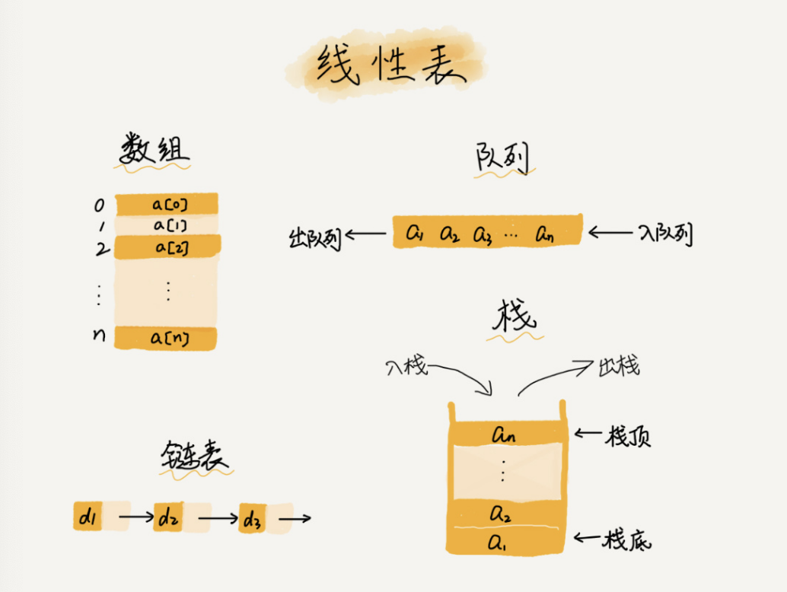

# 数组

## 概念

数组（Array）是一种线性表数据结构。它用一组连续的内存空间，来存储一组具有相同类型的数据。

关键的两处：

* 第一是线性表（Linear List）。顾名思义，线性表就是数据排成像一条线一样的结构。每个线性表上的数据最多只有前和后两个方向。其实除了数组，链表、队列、栈等也是线性表结构。

  

  而与它相对立的概念是非线性表，比如二叉树、堆、图等。之所以叫非线性，是因为，在非线性表中，数据之间并不是简单的前后关系。

  

* 第二个是连续的内存空间和相同类型的数据。由于这种物理上的特性，因此数组支持“随机访问”。但有利就有弊，这两个限制也让数组的很多操作变得非常低效，比如要想在数组中删除、插入一个数据，为了保证连续性，就需要做大量的数据搬移工作。

## 数组是如何实现根据下标随机访问数组元素的？

拿一个长度为 10 的 int 类型的数组 int[] a = new int[10]来举例。计算机给数组 a[10]，分配了一块连续内存空间 1000～1039，其中，内存块的首地址为 base_address = 1000。我们知道，计算机会给每个内存单元分配一个地址，计算机通过地址来访问内存中的数据。当计算机需要随机访问数组中的某个元素时，它会首先通过下面的寻址公式，计算出该元素存储的内存地址：

```
a[i]_address = base_address + i * data_type_size
```

低效的“插入”和“删除”

插入

假设数组的长度为 n，现在，如果我们需要将一个数据插入到数组中的第 k 个位置。为了把第 k 个位置腾出来，给新来的数据，我们需要将第 k～n 这部分的元素都顺序地往后挪一位。那插入操作的时间复杂度是多少呢？

如果在数组的末尾插入元素，那就不需要移动数据了，这时的时间复杂度为 O(1)。但如果在数组的开头插入元素，那所有的数据都需要依次往后移动一位，所以最坏时间复杂度是 O(n)。 因为我们在每个位置插入元素的概率是一样的，所以平均情况时间复杂度为 (1+2+…n)/n=O(n)。如果数组中的数据是有序的，我们在某个位置插入一个新的元素时，就必须按照刚才的方法搬移 k 之后的数据。但是，如果数组中存储的数据并没有任何规律，数组只是被当作一个存储数据的集合。在这种情况下，如果要将某个数据插入到第 k 个位置，为了避免大规模的数据搬移，我们还有一个简单的办法就是，直接将第 k 位的数据搬移到数组元素的最后，把新的元素直接放入第 k 个位置。

删除

跟插入数据类似，如果我们要删除第 k 个位置的数据，为了内存的连续性，也需要搬移数据，不然中间就会出现空洞，内存就不连续了。和插入类似，如果删除数组末尾的数据，则最好情况时间复杂度为 O(1)；如果删除开头的数据，则最坏情况时间复杂度为 O(n)；平均情况时间复杂度也为 O(n)。实际上，在某些特殊场景下，我们并不一定非得追求数组中数据的连续性。如果我们将多次删除操作集中在一起执行，删除的效率是不是会提高很多呢？


如果你了解 JVM，你会发现，这不就是 JVM 标记清除垃圾回收算法的核心思想吗？没错，数据结构和算法的魅力就在于此，很多时候我们并不是要去死记硬背某个数据结构或者算法，而是要学习它背后的思想和处理技巧，这些东西才是最有价值的。如果你细心留意，不管是在软件开发还是架构设计中，总能找到某些算法和数据结构的影子。

警惕数组的访问越界问题

```c
int main(int argc, char* argv[]){
    int i = 0;
    int arr[3] = {0};
    for(; i<=3; i++){
        arr[i] = 0;
        printf("hello world\n");
    }
    return 0;
}
```

你发现问题了吗？这段代码的运行结果并非是打印三行“hello word”，而是会无限打印“hello world”，这是为什么呢？因为，数组大小为 3，a[0]，a[1]，a[2]，而我们的代码因为书写错误，导致 for 循环的结束条件错写为了 i<=3 而非 i<3，所以当 i=3 时，数组 a[3]访问越界。我们知道，在 C 语言中，只要不是访问受限的内存，所有的内存空间都是可以自由访问的。根据我们前面讲的数组寻址公式，a[3]也会被定位到某块不属于数组的内存地址上，而这个地址正好是存储变量 i 的内存地址，那么 a[3]=0 就相当于 i=0，所以就会导致代码无限循环。

数组越界在 C 语言中是一种未决行为，并没有规定数组访问越界时编译器应该如何处理。因为，访问数组的本质就是访问一段连续内存，只要数组通过偏移计算得到的内存地址是可用的，那么程序就可能不会报任何错误。这种情况下，一般都会出现莫名其妙的逻辑错误，就像我们刚刚举的那个例子，debug 的难度非常的大。而且，很多计算机病毒也正是利用到了代码中的数组越界可以访问非法地址的漏洞，来攻击系统，所以写代码的时候一定要警惕数组越界。但并非所有的语言都像 C 一样，把数组越界检查的工作丢给程序员来做，像 Java 本身就会做越界检查，比如下面这几行 Java 代码，就会抛出 java.lang.ArrayIndexOutOfBoundsException。

## 容器能否完全替代数组？

针对数组类型，很多语言都提供了容器类，比如 Java 中的 ArrayList、C++ STL 中的 vector。在项目开发中，什么时候适合用数组，什么时候适合用容器呢？这里我拿 Java 语言来举例。如果你是 Java 工程师，几乎天天都在用 ArrayList，对它应该非常熟悉。那它与数组相比，到底有哪些优势呢？ArrayList 最大的优势就是可以将很多数组操作的细节封装起来。比如前面提到的数组插入、删除数据时需要搬移其他数据等。另外，它还有一个优势，就是支持动态扩容。

1. Java ArrayList 无法存储基本类型，比如 int、long，需要封装为 Integer、Long 类，而 Autoboxing、Unboxing 则有一定的性能消耗，所以如果特别关注性能，或者希望使用基本类型，就可以选用数组。

2. 如果数据大小事先已知，并且对数据的操作非常简单，用不到 ArrayList 提供的大部分方法，也可以直接使用数组。
3. 还有一个是我个人的喜好，当要表示多维数组时，用数组往往会更加直观。比如 Object[][] array；而用容器的话则需要这样定义：ArrayList > array。我总结一下，对于业务开发，直接使用容器就足够了，省时省力。毕竟损耗一丢丢性能，完全不会影响到系统整体的性能。但如果你是做一些非常底层的开发，比如开发网络框架，性能的优化需要做到极致，这个时候数组就会优于容器，成为首选。