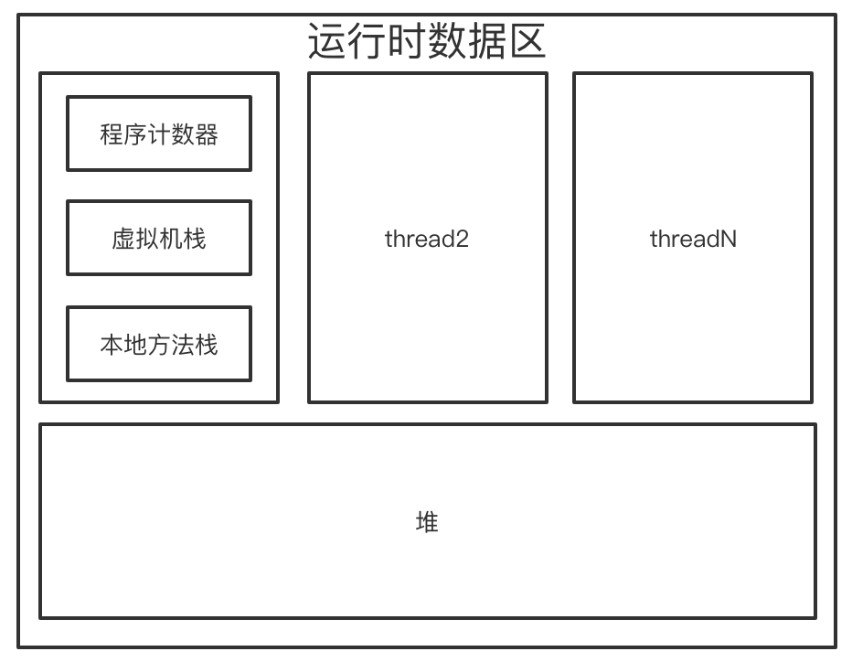

jvm会将其管理的内存划分若干个不同

程序计数器：

线程私有

当前线程所执行的字节码的行号指示器

如果线程正在执行native方法，计数器为空undefined，唯一一个在Java虚拟机规范中没有规定任何OutOfMemory情况的区域

虚拟机栈

线程私有

生命周期和线程相同

每个方法执行会创建栈帧，存储局部变量表，操作数栈，动态链接，方法出口等信息。局部变量表存放编译器可知的基本数据类型和引用。64位的long和double占用两个局部变量空间slot，其余占一个

编译期确定

oom线程请求的栈深度大雨虚拟机所允许的深度，将抛出StackOverflowError异常

如果虚拟机栈可以动态扩展，如果扩展时无法申请足够的内存，就会抛出oom

本地方法栈

虚拟机执行Native方法使用，

堆：所有的对象实例和数组都要在堆上分配，逃逸分析

物理上不连续，逻辑上连续。

可扩展，xmx xms

方法区---永久代

存放已经被虚拟机加载的

类信息

常量

静态变量

即时编译器编译后的代码等数据

运行时常量池-编译期生成的各种字面量和符号引用，动态性string

