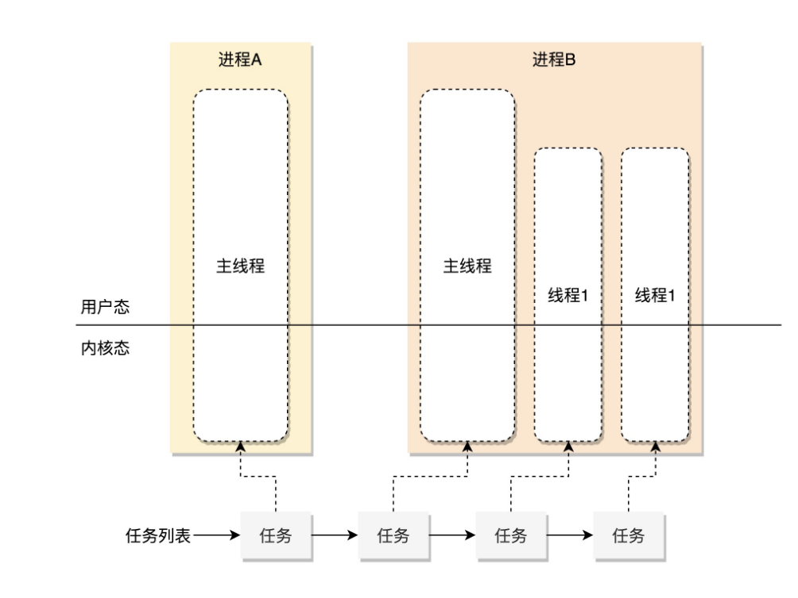
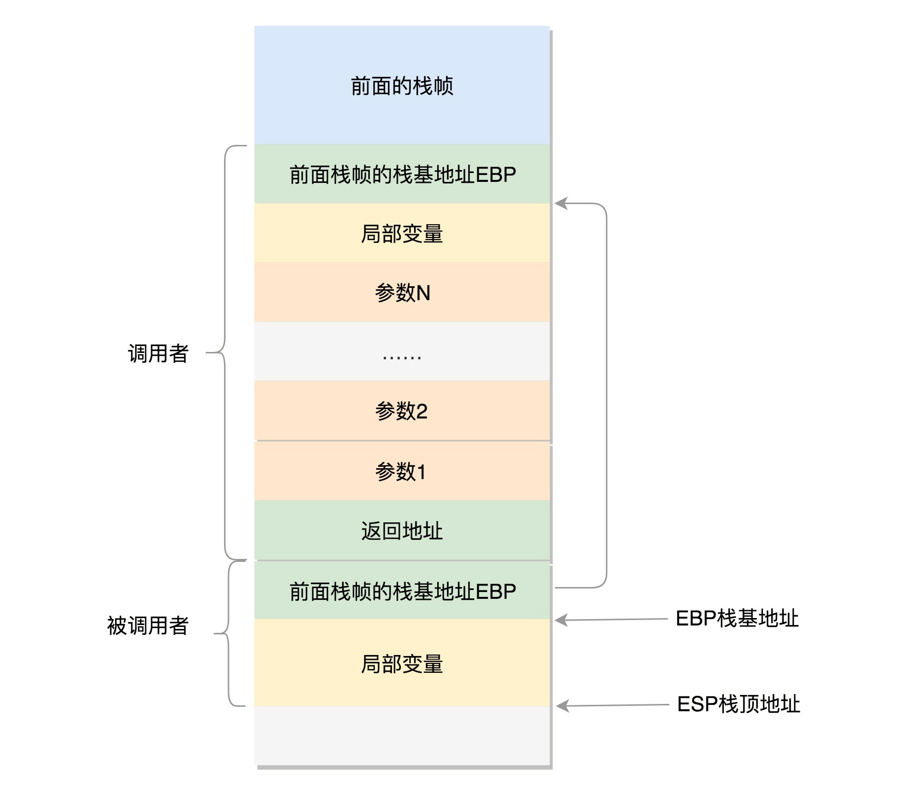
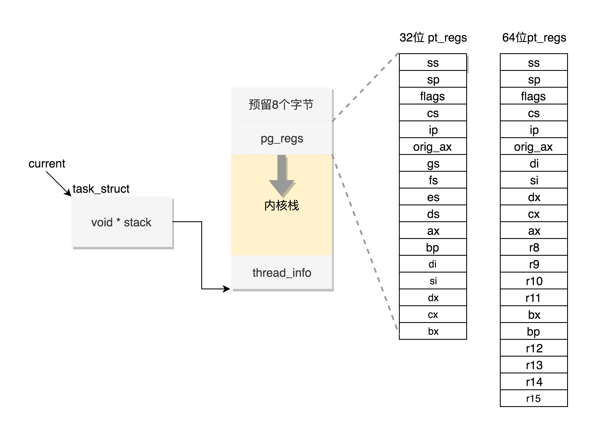

同样在 Linux 里面，无论是进程，还是线程，到了内核里面，我们统一都叫任务（Task），由一个统一的结构 task_struct 进行管理。这个结构非常复杂，但你也不用怕，我们慢慢来解析。



首先，所有执行的项目应该有个项目列表吧，所以 Linux 内核也应该先弄一个链表，将所有的 task_struct 串起来。

```c
struct list_head tasks;
```

接下来，我们来看每一个任务都应该包含哪些字段。

任务 ID

每一个任务都应该有一个 ID，作为这个任务的唯一标识。到时候排期啊、下发任务啊等等，都按 ID 来，就不会产生歧义。

task_struct 里面涉及任务 ID 的，有下面几个：

```c
pid_t pid; 
pid_t tgid;
struct task_struct *group_leader;
```

为啥会有两个id，所以在内核中，它们虽然都是任务，但是应该加以区分。其中，pid 是 process id，tgid 是 thread group ID

任何一个进程，如果只有主线程，那 pid 是自己，tgid 是自己，group_leader 指向的还是自己。但是，如果一个进程创建了其他线程，那就会有所变化了。线程有自己的 pid，tgid 就是进程的主线程的 pid，group_leader 指向的就是进程的主线程。好了，有了 tgid，我们就知道 tast_struct 代表的是一个进程还是代表一个线程了。

pid唯一标识每个任务

tgid指向进程的主线程的pid

group_leader 指向主线程的数据机构

###信号处理

```c
/* Signal handlers: */
struct signal_struct *signal;
struct sighand_struct *sighand;
sigset_t blocked;
sigset_t real_blocked;
sigset_t saved_sigmask;
struct sigpending pending;
unsigned long sas_ss_sp;size_t sas_ss_size;
unsigned int sas_ss_flags;
```

这里定义了哪些信号被阻塞暂不处理（blocked），哪些信号尚等待处理（pending），哪些信号正在通过信号处理函数进行处理（sighand）。处理的结果可以是忽略，可以是结束进程等等。

信号处理函数默认使用用户态的函数栈，当然也可以开辟新的栈专门用于信号处理，这就是 sas_ss_xxx 这三个变量的作用。上面我说了下发信号的时候，需要区分进程和线程。从这里我们其实也能看出一些端倪。

task_struct 里面有一个 struct sigpending pending。如果我们进入 struct signal_struct *signal 去看的话，还有一个 struct sigpending shared_pending。它们一个是本任务的，一个是线程组共享的。

###任务状态

```c
volatile long state; /* -1 unrunnable, 0 runnable, >0 stopped */ 
int exit_state; 
unsigned int flags;
```

### 进程调度

进程的状态切换往往涉及调度，下面这些字段都是用于调度的。为了让你理解 task_struct 进程管理的全貌，我先在这里列一下，咱们后面会有单独的章节讲解，这里你只要大概看一下里面的注释就好了。

```c
//是否在运行队列上
int        on_rq;
//优先级
int        prio;
int        static_prio;
int        normal_prio;
unsigned int      rt_priority;
//调度器类
const struct sched_class  *sched_class;
//调度实体
struct sched_entity    se;
struct sched_rt_entity    rt;
struct sched_dl_entity    dl;
//调度策略
unsigned int      policy;
//可以使用哪些CPU
int        nr_cpus_allowed;
cpumask_t      cpus_allowed;
struct sched_info    sched_info;
```

###用户栈和内核栈

如何将用户态的执行和内核态的执行串起来呢？这就需要以下两个重要的成员变量：

```c
struct thread_info thread_info;
void *stack;
```

####用户态函数栈

函数栈调用，在汇编层面其实就是指令的跳转，从代码的一个地方跳转到代码的另一个地方执行。栈帧的精确内容和结构因处理器架构和函数调用规则而不同。我们以 Intel x86 架构和使用 C 风格的函数调用的栈为例。

困难点在于：

- 参数传递。通过寄存器和栈传递。64位操作系统寄存器比较多，会使用rdi，rsi，rdx，rcx，r8，r9这六个寄存器传递。如果超过六个，超出的参数还是需要放到栈里面的。所有的参数都向8的倍数对齐。
- 返回地址

寄存器使用惯例，以x86-64为例：

- 被调用者保存寄存器：rbx，rbp，r12-r15，按需存储
- 调用者保存寄存器：除rsp以外的所有寄存器，所有函数都会修改

在进程地址空间中，栈是从高地址往低地址，往下增长的结构。上面是栈底，下面是栈顶。在cpu中，esp是栈顶指针寄存器，入栈操作push和出栈操作pop指令会自动调整esp的值，ebp是栈基地址指针寄存器，指向当前栈帧的最底部。



可以通过ebp + 4  找到参数，ebp - 4 找到局部变量。

####内核态函数栈

Linux 给每个 task 都分配了内核栈。

内核栈在 32 位系统上 arch/x86/include/asm/page_32_types.h，是这样定义的：一个 PAGE_SIZE 是 4K，左移一位就是乘以 2，也就是 8K。

```c
#define THREAD_SIZE_ORDER  1
#define THREAD_SIZE    (PAGE_SIZE << THREAD_SIZE_ORDER)
```

内核栈在 64 位系统上 arch/x86/include/asm/page_64_types.h，是这样定义的：在 PAGE_SIZE 的基础上左移两位，也即 16K，并且要求起始地址必须是 8192 的整数倍。

```c
#ifdef CONFIG_KASAN
#define KASAN_STACK_ORDER 1
#else
#define KASAN_STACK_ORDER 0
#endif


#define THREAD_SIZE_ORDER  (2 + KASAN_STACK_ORDER)
#define THREAD_SIZE  (PAGE_SIZE << THREAD_SIZE_ORDER)
```

内核栈是一个非常特殊的结构，如下图所示：



这段空间的最低位置，是一个 thread_info 结构。这个结构是对 task_struct 结构的补充。因为 task_struct 结构庞大但是通用，不同的体系结构就需要保存不同的东西，所以往往与体系结构有关的，都放在 thread_info 里面。在内核代码里面有这样一个 union，将 thread_info 和 stack 放在一起，在 include/linux/sched.h 文件中就有。

```c
// c语言中的union结构的空间大小会取thread_info和stack两者的最大值，此处也就是THREAD_SIZE
union thread_union {
#ifndef CONFIG_THREAD_INFO_IN_TASK
  struct thread_info thread_info;
#endif
  unsigned long stack[THREAD_SIZE/sizeof(long)];
};
```

这个 union 就是这样定义的，开头是 thread_info，后面是 stack。

在内核栈的最高地址端，存放的是另一个结构 pt_regs，定义如下。其中，32 位和 64 位的定义不一样。

```c

#ifdef __i386__
struct pt_regs {
  unsigned long bx;
  unsigned long cx;
  unsigned long dx;
  unsigned long si;
  unsigned long di;
  unsigned long bp;
  unsigned long ax;
  unsigned long ds;
  unsigned long es;
  unsigned long fs;
  unsigned long gs;
  unsigned long orig_ax;
  unsigned long ip;
  unsigned long cs;
  unsigned long flags;
  unsigned long sp;
  unsigned long ss;
};
#else 
struct pt_regs {
  unsigned long r15;
  unsigned long r14;
  unsigned long r13;
  unsigned long r12;
  unsigned long bp;
  unsigned long bx;
  unsigned long r11;
  unsigned long r10;
  unsigned long r9;
  unsigned long r8;
  unsigned long ax;
  unsigned long cx;
  unsigned long dx;
  unsigned long si;
  unsigned long di;
  unsigned long orig_ax;
  unsigned long ip;
  unsigned long cs;
  unsigned long flags;
  unsigned long sp;
  unsigned long ss;
/* top of stack page */
};
#endif 
```

看到这个是不是很熟悉？咱们在讲系统调用的时候，已经多次见过这个结构。当系统调用从用户态到内核态的时候，首先要做的第一件事情，就是将用户态运行过程中的 CPU 上下文保存起来，其实主要就是保存在这个结构的寄存器变量里。这样当从内核系统调用返回的时候，才能让进程在刚才的地方接着运行下去。如果我们对比系统调用那一节的内容，你会发现系统调用的时候，压栈的值的顺序和 struct pt_regs 中寄存器定义的顺序是一样的。在内核中，CPU 的寄存器 ESP 或者 RSP，已经指向内核栈的栈顶，在内核态里的调用都有和用户态相似的过程。

通过 task_struct 找内核栈

如果有一个 task_struct 的 stack 指针在手，你可以通过下面的函数找到这个线程内核栈：

```c

static inline void *task_stack_page(const struct task_struct *task)
{
  return task->stack;
}
```

从 task_struct 如何得到相应的 pt_regs 呢？我们可以通过下面的函数：

```c

/*
 * TOP_OF_KERNEL_STACK_PADDING reserves 8 bytes on top of the ring0 stack.
 * This is necessary to guarantee that the entire "struct pt_regs"
 * is accessible even if the CPU haven't stored the SS/ESP registers
 * on the stack (interrupt gate does not save these registers
 * when switching to the same priv ring).
 * Therefore beware: accessing the ss/esp fields of the
 * "struct pt_regs" is possible, but they may contain the
 * completely wrong values.
 */
#define task_pt_regs(task) \
({                  \
  unsigned long __ptr = (unsigned long)task_stack_page(task);  \
  __ptr += THREAD_SIZE - TOP_OF_KERNEL_STACK_PADDING;    \
  ((struct pt_regs *)__ptr) - 1;          \
})
```

你会发现，这是先从 task_struct 找到内核栈的开始位置。然后这个位置加上 THREAD_SIZE 就到了最后的位置，然后转换为 struct pt_regs，再减一，就相当于减少了一个 pt_regs 的位置，就到了这个结构的首地址。

这里面有一个 TOP_OF_KERNEL_STACK_PADDING，这个的定义如下：

```c
#ifdef CONFIG_X86_32
# ifdef CONFIG_VM86
#  define TOP_OF_KERNEL_STACK_PADDING 16
# else
#  define TOP_OF_KERNEL_STACK_PADDING 8
# endif
#else
# define TOP_OF_KERNEL_STACK_PADDING 0
#endif
```

也就是说，32 位机器上是 8，其他是 0。这是为什么呢？因为压栈 pt_regs 有两种情况。我们知道，CPU 用 ring 来区分权限，从而 Linux 可以区分内核态和用户态。因此，第一种情况，我们拿涉及从用户态到内核态的变化的系统调用来说。因为涉及权限的改变，会压栈保存 SS、ESP 寄存器的，这两个寄存器共占用 8 个 byte。另一种情况是，不涉及权限的变化，就不会压栈这 8 个 byte。这样就会使得两种情况不兼容。如果没有压栈还访问，就会报错，所以还不如预留在这里，保证安全。在 64 位上，修改了这个问题，变成了定长的。好了，现在如果你 task_struct 在手，就能够轻松得到内核栈和内核寄存器。

通过内核栈找 task_struct

这个艰巨的任务要交给 thread_info 这个结构。

```c
struct thread_info { 
  struct task_struct *task; /* main task structure */ 
  __u32 flags; /* low level flags */ 
  __u32 status; /* thread synchronous flags */ 
  __u32 cpu; /* current CPU */ 
  mm_segment_t addr_limit; 
  unsigned int sig_on_uaccess_error:1; 
  unsigned int uaccess_err:1; /* uaccess failed */
};
```

这里面有个成员变量 task 指向 task_struct，所以我们常用 current_thread_info()->task 来获取 task_struct。

```c

static inline struct thread_info *current_thread_info(void)
{
  return (struct thread_info *)(current_top_of_stack() - THREAD_SIZE);
}
```

而 thread_info 的位置就是内核栈的最高位置，减去 THREAD_SIZE，就到了 thread_info 的起始地址。但是现在变成这样了，只剩下一个 flags。

那这时候怎么获取当前运行中的 task_struct 呢？current_thread_info 有了新的实现方式。在 include/linux/thread_info.h 中定义了 current_thread_info。

```c
#include #define current_thread_info() ((struct thread_info *)current)#endif
```

那 current 又是什么呢？在 arch/x86/include/asm/current.h 中定义了。

```c

struct task_struct;


DECLARE_PER_CPU(struct task_struct *, current_task);


static __always_inline struct task_struct *get_current(void)
{
  return this_cpu_read_stable(current_task);
}


#define current get_current
```

到这里，你会发现，新的机制里面，每个 CPU 运行的 task_struct 不通过 thread_info 获取了，而是直接放在 Per CPU 变量里面了。多核情况下，CPU 是同时运行的，但是它们共同使用其他的硬件资源的时候，我们需要解决多个 CPU 之间的同步问题。Per CPU 变量是内核中一种重要的同步机制。顾名思义，Per CPU 变量就是为每个 CPU 构造一个变量的副本，这样多个 CPU 各自操作自己的副本，互不干涉。比如，当前进程的变量 current_task 就被声明为 Per CPU 变量。要使用 Per CPU 变量，首先要声明这个变量，在 arch/x86/include/asm/current.h 中有：

```c
DECLARE_PER_CPU(struct task_struct *, current_task);
```

然后是定义这个变量，在 arch/x86/kernel/cpu/common.c 中有：

```c
DEFINE_PER_CPU(struct task_struct *, current_task) = &init_task;
```

也就是说，系统刚刚初始化的时候，current_task 都指向 init_task。当某个 CPU 上的进程进行切换的时候，current_task 被修改为将要切换到的目标进程。例如，进程切换函数 __switch_to 就会改变 current_task。

```c
__visible __notrace_funcgraph struct task_struct *
__switch_to(struct task_struct *prev_p, struct task_struct *next_p)
{
......
this_cpu_write(current_task, next_p);
......
return prev_p;
}
```

当要获取当前的运行中的 task_struct 的时候，就需要调用 this_cpu_read_stable 进行读取。

```c
#define this_cpu_read_stable(var)       percpu_stable_op("mov", var)
```

