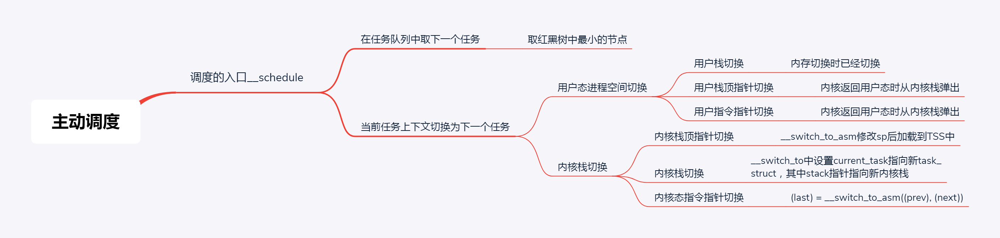

调度策略与调度类

在 Linux 里面，进程大概可以分成两种。

一种称为实时进程，也就是需要尽快执行返回结果的那种。这就好比我们是一家公司，接到的客户项目需求就会有很多种。有些客户的项目需求比较急，比如一定要在一两个月内完成的这种，客户会加急加钱，那这种客户的优先级就会比较高。

另一种是普通进程，大部分的进程其实都是这种。这就好比，大部分客户的项目都是普通的需求，可以按照正常流程完成，优先级就没实时进程这么高，但是人家肯定也有确定的交付日期。

那很显然，对于这两种进程，我们的调度策略肯定是不同的。在 task_struct 中，有一个成员变量，我们叫调度策略。

```c
unsigned int policy;
```

它有以下几个定义：

```c
#define SCHED_NORMAL    0
#define SCHED_FIFO    1
#define SCHED_RR    2
#define SCHED_BATCH    3
#define SCHED_IDLE    5
#define SCHED_DEADLINE    6
```

配合调度策略的，还有我们刚才说的优先级，也在 task_struct 中。

```c
int prio, static_prio, normal_prio;
unsigned int rt_priority;
```

优先级其实就是一个数值，对于实时进程，优先级的范围是 0～99；对于普通进程，优先级的范围是 100～139。数值越小，优先级越高。从这里可以看出，所有的实时进程都比普通进程优先级要高。毕竟，谁让人家加钱了呢。

实时调度策略

对于调度策略，其中 SCHED_FIFO、SCHED_RR、SCHED_DEADLINE 是实时进程的调度策略。

普通调度策略

对于普通进程的调度策略有，SCHED_NORMAL、SCHED_BATCH、SCHED_IDLE。

上面无论是 policy 还是 priority，都设置了一个变量，变量仅仅表示了应该这样这样干，但事情总要有人去干，谁呢？在 task_struct 里面，还有这样的成员变量：

```c
const struct sched_class *sched_class;
```

调度策略的执行逻辑，就封装在这里面，它是真正干活的那个。

sched_class 有几种实现：

- stop_sched_class 优先级最高的任务会使用这种策略，会中断所有其他线程，且不会被其他任务打断；
- dl_sched_class 就对应上面的 deadline 调度策略；
- rt_sched_class 就对应 RR 算法或者 FIFO 算法的调度策略，具体调度策略由进程的 task_struct->policy 指定；
- fair_sched_class 就是普通进程的调度策略；
- idle_sched_class 就是空闲进程的调度策略。

完全公平调度算法

在 Linux 里面，实现了一个基于 CFS 的调度算法。CFS 全称 Completely Fair Scheduling，叫完全公平调度。听起来很“公平”。那这个算法的原理是什么呢？我们来看看。

首先，你需要记录下进程的运行时间。CPU 会提供一个时钟，过一段时间就触发一个时钟中断。就像咱们的表滴答一下，这个我们叫 Tick。CFS 会为每一个进程安排一个虚拟运行时间 vruntime。如果一个进程在运行，随着时间的增长，也就是一个个 tick 的到来，进程的 vruntime 将不断增大。没有得到执行的进程 vruntime 不变。

显然，那些 vruntime 少的，原来受到了不公平的对待，需要给它补上，所以会优先运行这样的进程。这有点像让你把一筐球平均分到 N 个口袋里面，你看着哪个少，就多放一些；哪个多了，就先不放。这样经过多轮，虽然不能保证球完全一样多，但是也差不多公平。你可能会说，不还有优先级呢？如何给优先级高的进程多分时间呢？这个简单，就相当于 N 个口袋，优先级高的袋子大，优先级低的袋子小。这样球就不能按照个数分配了，要按照比例来，大口袋的放了一半和小口袋放了一半，里面的球数目虽然差很多，也认为是公平的。在更新进程运行的统计量的时候，我们其实就可以看出这个逻辑。

调度队列与调度实体

看来 CFS 需要一个数据结构来对 vruntime 进行排序，找出最小的那个。这个能够排序的数据结构不但需要查询的时候，能够快速找到最小的，更新的时候也需要能够快速地调整排序，要知道 vruntime 可是经常在变的，变了再插入这个数据结构，就需要重新排序。能够平衡查询和更新速度的是树，在这里使用的是红黑树。

红黑树的的节点是应该包括 vruntime 的，称为调度实体。在 task_struct 中有这样的成员变量：

struct sched_entity se; 完全公平算法调度实体

struct sched_rt_entity rt; 实时调度实体

struct sched_dl_entity dl; Deadline 调度实体

## 主动调度

下面是主动调度的基本过程：



我们先看调度的一个入口函数 schedule 的调用过程。进程的调度都最终会调用到 __schedule 函数。我姑且给它起个名字，就叫“进程调度第一定律”。

```c
asmlinkage __visible void __sched schedule(void)
{
  struct task_struct *tsk = current;

  sched_submit_work(tsk);
  do {
    preempt_disable();
    // 进程调度第一定律
    __schedule(false);
    sched_preempt_enable_no_resched();
  } while (need_resched());
}
```

这段代码的主要逻辑是在 __schedule 函数中实现的。这个函数比较复杂，我们分几个部分来讲解。

```c
static void __sched notrace __schedule(bool preempt)
{
  struct task_struct *prev, *next;
  unsigned long *switch_count;
  struct rq_flags rf;
  struct rq *rq;
  int cpu;

  cpu = smp_processor_id();
  // 在当前的 CPU 上，取出任务队列 rq。
  rq = cpu_rq(cpu);
  // 当前 CPU 的任务队列上面正在运行的那个进程 curr
  prev = rq->curr;
......
```

第一步，在当前的 CPU 上，取出任务队列 rq。

第二步，获取下一个任务，task_struct *next 指向下一个任务，这就是继任。

```c
// 获取下一个任务，这就是继任。
next = pick_next_task(rq, prev, &rf);
clear_tsk_need_resched(prev);
clear_preempt_need_resched();
```

第三步，当选出的继任者和前任不同，就要进行上下文切换，继任者进程正式进入运行。

```c
// 当选出的继任者和前任不同，就要进行上下文切换，继任者进程正式进入运行。
if (likely(prev != next)) {
    rq->nr_switches++;
    rq->curr = next;
    ++*switch_count;
......
  	// 上下文切换
    rq = context_switch(rq, prev, next, &rf);
```

### 进程上下文切换

上下文切换主要干两件事情，一是切换进程空间，也即虚拟内存；二是切换寄存器和 CPU 上下文。先看下context_switch的实现：

首先是内存空间的切换，在此不详细介绍。

```c
/*
 * context_switch - switch to the new MM and the new thread's register state.
 */
static __always_inline struct rq *
context_switch(struct rq *rq, struct task_struct *prev,
         struct task_struct *next, struct rq_flags *rf)
{
  // 内存空间的切换。每个进程的用户栈都是独立的，都在内存空间里面，切换了内存空间之后，用户栈自然也切换了。
  // 从用户空间进入到内核空间时，会将用户栈顶指针，指令指针等保存在内核栈中
  struct mm_struct *mm, *oldmm;
......
  mm = next->mm;
  oldmm = prev->active_mm;
......
  switch_mm_irqs_off(oldmm, mm, next);
......
  /* Here we just switch the register state and the stack. */
  // 寄存器和栈的切换，它调用到了 __switch_to_asm。这是一段汇编代码，主要用于栈的切换。
  switch_to(prev, next, prev);
  barrier();
  return finish_task_switch(prev);
}
```

接下来，我们看 switch_to。它就是寄存器和栈的切换，它调用到了 __switch_to_asm。这是一段汇编代码，主要用于栈的切换。

```c
#define switch_to(prev, next, last)          \
do {                  \
  prepare_switch_to(prev, next);          \
                  \
  ((last) = __switch_to_asm((prev), (next)));      \
} while (0)
```

对于 32 位操作系统来讲，切换的是栈顶指针 esp。

```c
/*
 * %eax: prev task
 * %edx: next task
 */
ENTRY(__switch_to_asm)
......
  /* switch stack */
  movl  %esp, TASK_threadsp(%eax)
  movl  TASK_threadsp(%edx), %esp
......
  jmp  __switch_to
END(__switch_to_asm)
```

对于 64 位操作系统来讲，切换的是栈顶指针 rsp。

```c
/*
 * %rdi: prev task
 * %rsi: next task
 */
ENTRY(__switch_to_asm)
......
  /* switch stack */
  movq  %rsp, TASK_threadsp(%rdi)
  movq  TASK_threadsp(%rsi), %rsp
......
  jmp  __switch_to
END(__switch_to_asm)
```

最终，都返回了 __switch_to 这个函数。这个函数对于 32 位和 64 位操作系统虽然有不同的实现，但里面做的事情是差不多的。所以我这里仅仅列出 64 位操作系统做的事情。

```c
__visible __notrace_funcgraph struct task_struct *
__switch_to(struct task_struct *prev_p, struct task_struct *next_p)
{
  struct thread_struct *prev = &prev_p->thread;
  struct thread_struct *next = &next_p->thread;
......
  int cpu = smp_processor_id();
  struct tss_struct *tss = &per_cpu(cpu_tss, cpu);
......
  load_TLS(next, cpu);
......
  // 这里将cpu上的current_task指向继任任务，也就完成了内核栈的切换
  this_cpu_write(current_task, next_p);

  /* Reload esp0 and ss1.  This changes current_thread_info(). */
  // 将继任进程的 thread_struct 的 sp0 的值加载到 tss_struct 里面去,对于 CPU 来讲，这就算是完成了切换。
  load_sp0(tss, next);
......
  return prev_p;
}
```

在 x86 体系结构中，提供了一种以硬件的方式进行进程切换的模式，对于每个进程，x86 希望在内存里面维护一个 TSS（Task State Segment，任务状态段）结构。这里面有所有的寄存器。另外，还有一个特殊的寄存器 TR（Task Register，任务寄存器），指向某个进程的 TSS。更改 TR 的值，将会触发硬件保存 CPU 所有寄存器的值到当前进程的 TSS 中，然后从新进程的 TSS 中读出所有寄存器值，加载到 CPU 对应的寄存器中。

但是这样有个缺点。我们做进程切换的时候，没必要每个寄存器都切换，这样每个进程一个 TSS，就需要全量保存，全量切换，动作太大了。

于是，Linux 操作系统想了一个办法。还记得在系统初始化的时候，会调用 cpu_init 吗？这里面会给每一个 CPU 关联一个 TSS，然后将 TR 指向这个 TSS，然后在操作系统的运行过程中，TR 就不切换了，永远指向这个 TSS。TSS 用数据结构 tss_struct 表示。

```c
void cpu_init(void)
{
  int cpu = smp_processor_id();
  struct task_struct *curr = current;
  struct tss_struct *t = &per_cpu(cpu_tss, cpu);
    ......
    load_sp0(t, thread);
  set_tss_desc(cpu, t);
  load_TR_desc();
    ......
}

struct tss_struct {
  /*
   * The hardware state:
   */
  struct x86_hw_tss  x86_tss;
  unsigned long    io_bitmap[IO_BITMAP_LONGS + 1];
} 
```

在 Linux 中，真的参与进程切换的寄存器很少，主要的就是栈顶寄存器。于是，在 task_struct 里面，还有一个我们原来没有注意的成员变量 thread。这里面保留了要切换进程的时候需要修改的寄存器。

所谓的进程切换，就是将某个进程的 thread_struct 里面的寄存器的值，写入到 CPU 的 TR 指向的 tss_struct，对于 CPU 来讲，这就算是完成了切换。

内核态指令指针何时切换？需要搞清楚为什么switch_to有三个参数。

```c
#define switch_to(prev, next, last)          \
do {                  \
  prepare_switch_to(prev, next);          \
                  \
  ((last) = __switch_to_asm((prev), (next)));      \
} while (0)
```

需要解析

A -》 B -〉 A

a b

c-a

## 抢占式调度

什么情况下会发生抢占呢？最常见的现象就是一个进程执行时间太长了，是时候切换到另一个进程了。