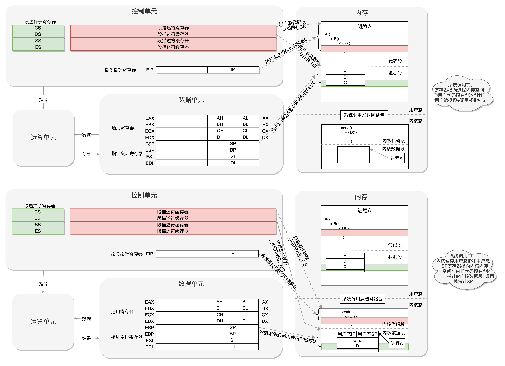

## 内核初始化

从实模式切换到了保护模式

内核的启动从入口函数 start_kernel() 开始。在 init/main.c 文件中，start_kernel 相当于内核的 main 函数。

start_kernel()

​	INIT_TASK(init_task）0号进程

​	trap_init

​	mm_init

​	sched_init

​	rest_init 1.kernel_thread(kernel_init,NULL,CLONE_FS) 一号进程，用户态总管

​                  2.kernel_thread(kthreadd,NULL,CLONE_FS | CLONE_FILES) 二号进程，内核态总管

在操作系统里面，先要有个创始进程，有一行指令 set_task_stack_end_magic(&init_task)。这里面有一个参数 init_task，它的定义是 struct task_struct init_task = INIT_TASK(init_task)。它是系统创建的第一个进程，我们称为 0 号进程。这是唯一一个没有通过 fork 或者 kernel_thread 产生的进程，是进程列表的第一个。

这里面对应的函数是 trap_init()，里面设置了很多中断门（Interrupt Gate），用于处理各种中断。其中有一个 set_system_intr_gate(IA32_SYSCALL_VECTOR, entry_INT80_32)，这是系统调用的中断门。系统调用也是通过发送中断的方式进行的。当然，64 位的有另外的系统调用方法，





这个过程就是这样的：用户态 - 系统调用 - 保存寄存器 - 内核态执行系统调用 - 恢复寄存器 - 返回用户态，然后接着运行。

初始化 1 号进程

rest_init 的第一大工作是，用 kernel_thread(kernel_init, NULL, CLONE_FS) 创建第二个进程，这个是 1 号进程。

## 从内核态到用户态

我们再回到 1 号进程启动的过程。当前执行 kernel_thread 这个函数的时候，我们还在内核态，现在我们就来跨越这道屏障，到用户态去运行一个程序。这该怎么办呢？很少听说“先内核态再用户态”的。

kernel_thread 的参数是一个函数 kernel_init，也就是这个进程会运行这个函数。在 kernel_init 里面，会调用 kernel_init_freeable()，里面有这样的代码：

```c
if (!ramdisk_execute_command)
    ramdisk_execute_command = "/init";
```

先不管 ramdisk 是啥，我们回到 kernel_init 里面。这里面有这样的代码块：

```c

  if (ramdisk_execute_command) {
    ret = run_init_process(ramdisk_execute_command);
......
  }
......
  if (!try_to_run_init_process("/sbin/init") ||
      !try_to_run_init_process("/etc/init") ||
      !try_to_run_init_process("/bin/init") ||
      !try_to_run_init_process("/bin/sh"))
    return 0;

```

这就说明，1 号进程运行的是一个文件。如果我们打开 run_init_process 函数，会发现它调用的是 do_execve。这个名字是不是看起来很熟悉？前面讲系统调用的时候，execve 是一个系统调用，它的作用是运行一个执行文件。加一个 do_ 的往往是内核系统调用的实现。没错，这就是一个系统调用，它会尝试运行 ramdisk 的“/init”，或者普通文件系统上的“/sbin/init”“/etc/init”“/bin/init”“/bin/sh”。不同版本的 Linux 会选择不同的文件启动，但是只要有一个起来了就可以。

```c
static int run_init_process(const char *init_filename)
{
  argv_init[0] = init_filename;
  return do_execve(getname_kernel(init_filename),
    (const char __user *const __user *)argv_init,
    (const char __user *const __user *)envp_init);
}
```

do_execve->do_execveat_common->exec_binprm->search_binary_handler，这里面会调用这段内容。也就是说，我要运行一个程序，需要加载这个二进制文件，这就是我们常说的项目执行计划书。它是有一定格式的。Linux 下一个常用的格式是 ELF（Executable and Linkable Format，可执行与可链接格式）。最后调用 start_thread。

```c

void
start_thread(struct pt_regs *regs, unsigned long new_ip, unsigned long new_sp)
{
set_user_gs(regs, 0);
regs->fs  = 0;
regs->ds  = __USER_DS;
regs->es  = __USER_DS;
regs->ss  = __USER_DS;
regs->cs  = __USER_CS;
regs->ip  = new_ip;
regs->sp  = new_sp;
regs->flags  = X86_EFLAGS_IF;
force_iret();
}
EXPORT_SYMBOL_GPL(start_thread);
```

struct pt_regs，看名字里的 register，就是寄存器啊！这个结构就是在系统调用的时候，内核中保存用户态运行上下文的，里面将用户态的代码段 CS 设置为 __USER_CS，将用户态的数据段 DS 设置为 __USER_DS，以及指令指针寄存器 IP、栈指针寄存器 SP。这里相当于补上了原来系统调用里，保存寄存器的一个步骤。最后的 iret 是干什么的呢？它是用于从系统调用中返回。这个时候会恢复寄存器。从哪里恢复呢？按说是从进入系统调用的时候，保存的寄存器里面拿出。好在上面的函数补上了寄存器。CS 和指令指针寄存器 IP 恢复了，指向用户态下一个要执行的语句。DS 和函数栈指针 SP 也被恢复了，指向用户态函数栈的栈顶。所以，下一条指令，就从用户态开始运行了。

ramdisk 的作用

init 终于从内核到用户态了。一开始到用户态的是 ramdisk 的 init，后来会启动真正根文件系统上的 init，成为所有用户态进程的祖先。

这是一个基于内存的文件系统。为啥会有这个呢？

是因为刚才那个 init 程序是在文件系统上的，文件系统一定是在一个存储设备上的，例如硬盘。Linux 访问存储设备，要有驱动才能访问。如果存储系统数目很有限，那驱动可以直接放到内核里面，反正前面我们加载过内核到内存里了，现在可以直接对存储系统进行访问。但是存储系统越来越多了，如果所有市面上的存储系统的驱动都默认放进内核，内核就太大了。这该怎么办呢？我们只好先弄一个基于内存的文件系统。内存访问是不需要驱动的，这个就是 ramdisk。这个时候，ramdisk 是根文件系统。然后，我们开始运行 ramdisk 上的 /init。等它运行完了就已经在用户态了。/init 这个程序会先根据存储系统的类型加载驱动，有了驱动就可以设置真正的根文件系统了。有了真正的根文件系统，ramdisk 上的 /init 会启动文件系统上的 init。接下来就是各种系统的初始化。启动系统的服务，启动控制台，用户就可以登录进来了。先别忙着高兴，rest_init 的第一个大事情才完成。我们仅仅形成了用户态所有进程的祖先。

创建 2 号进程


这里的函数 kthreadd，负责所有内核态的线程的调度和管理，是内核态所有线程运行的祖先。

