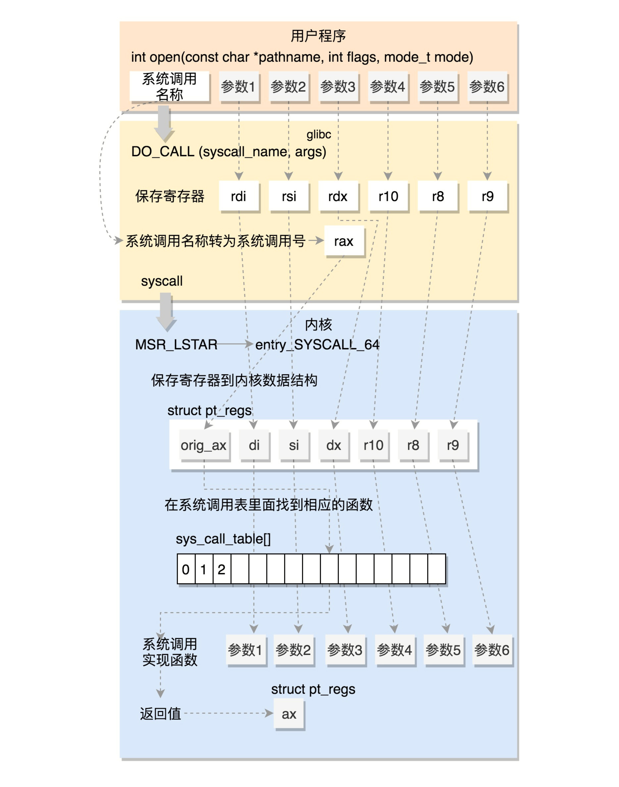

## 1. 内核空间和用户空间

内核空间可以执行任意命令，调用系统的一切资源

用户空间只能执行简单的运算，不能直接调用系统资源，必须通过系统接口（又称 system call），才能向内核发出指令

### 1.1 为什么划分两个空间？

- 提高操作系统的稳定性及可用性
- 稳定性：即便是单个应用程序出现错误也不会影响到操作系统的稳定性，这样其它的程序还可以正常的运行
- 可用性：用户代码运行代码受到限制（cpu）

### 1.2 用户态和内核态

当进程运行在内核空间时就处于内核态，而进程运行在用户空间时则处于用户态。

## 2. 系统调用

系统调用是桥梁。但是比较底层，glibc对其进行封装，易用。以最常用的系统调用 open，打开一个文件为线索，看看系统调用是怎么实现的。

## glibc 对系统调用的封装

现在我们就开始在用户态进程里面调用 open 函数。为了方便，大部分用户会选择使用 glibc 里面的 open 函数。这个函数是如何定义的呢？

```c
int open(const char *pathname, int flags, mode_t mode)
```

在 glibc 的源代码中，有个文件 syscalls.list，里面列着所有 glibc 的函数对应的系统调用，就像下面这个样子：

```c
# File name Caller  Syscall name    Args    Strong name Weak names
open    -  open    Ci:siv  __libc_open __open open
```

另外，glibc 还有一个脚本 make-syscall.sh，可以根据上面的配置文件，对于每一个封装好的系统调用，生成一个文件。这个文件里面定义了一些宏，例如 #define SYSCALL_NAME open。

glibc 还有一个文件 syscall-template.S，使用上面这个宏，定义了这个系统调用的调用方式。

```c
T_PSEUDO (SYSCALL_SYMBOL, SYSCALL_NAME, SYSCALL_NARGS)
    ret
T_PSEUDO_END (SYSCALL_SYMBOL)

#define T_PSEUDO(SYMBOL, NAME, N)    PSEUDO (SYMBOL, NAME, N)
```

这里的 PSEUDO 也是一个宏，它的定义如下：

```c
#define PSEUDO(name, syscall_name, args)                      \
  .text;                                      \
  ENTRY (name)                                    \
    DO_CALL (syscall_name, args);                         \
    cmpl $-4095, %eax;                               \
    jae SYSCALL_ERROR_LABEL
```

里面对于任何一个系统调用，会调用 DO_CALL。这也是一个宏，这个宏 32 位和 64 位的定义是不一样的。

## 32 位系统调用过程

我们先来看 32 位的情况（[glibc/sysdeps/unix/sysv/linux/i386/sysdep.h](https://code.woboq.org/userspace/glibc/sysdeps/unix/sysv/linux/i386/sysdep.h.html)）

```c

/* Linux takes system call arguments in registers:
  syscall number  %eax       call-clobbered
  arg 1    %ebx       call-saved
  arg 2    %ecx       call-clobbered
  arg 3    %edx       call-clobbered
  arg 4    %esi       call-saved
  arg 5    %edi       call-saved
  arg 6    %ebp       call-saved
......
*/
#define DO_CALL(syscall_name, args)                           \
    // 将请求参数放在寄存器里面
    PUSHARGS_##args                               \
    DOARGS_##args                                 \
    // 根据系统调用的名称，得到系统调用号，放在寄存器 eax 里面
    movl $SYS_ify (syscall_name), %eax;                          \
    // 软中断，陷入内核中
    ENTER_KERNEL                                  \
    POPARGS_##args
```

这里面的 ENTER_KERNEL 是什么呢？

```c
// int 就是 interrupt，也就是“中断”的意思。int $0x80 就是触发一个软中断，通过它就可以陷入（trap）内核。
# define ENTER_KERNEL int $0x80
```

在内核启动的时候，还记得有一个 trap_init()，其中有这样的代码：

```c
// IA32_SYSCALL_VECTOR是一个系统调用表
set_system_intr_gate(IA32_SYSCALL_VECTOR, entry_INT80_32);
```

这是一个软中断的陷入门。当接收到一个系统调用的时候，entry_INT80_32 就被调用了。

```c
ENTRY(entry_INT80_32)
        ASM_CLAC
        // 通过 push 和 SAVE_ALL 将当前用户态的寄存器，保存在 pt_regs 结构里面。
        pushl   %eax                    /* pt_regs->orig_ax */
        SAVE_ALL pt_regs_ax=$-ENOSYS    /* save rest */
        movl    %esp, %eax
        call    do_syscall_32_irqs_on
.Lsyscall_32_done:
......
.Lirq_return:
  // 系统调用结束后返回
  INTERRUPT_RETURN
```

然后调用 do_syscall_32_irqs_on。它的实现如下：

```c
static __always_inline void do_syscall_32_irqs_on(struct pt_regs *regs)
{
  struct thread_info *ti = current_thread_info();
  // 将系统调用号从 eax 里面取出来
  unsigned int nr = (unsigned int)regs->orig_ax;
......
  if (likely(nr < IA32_NR_syscalls)) {
    // 然后根据系统调用号，在系统调用表 ia32_sys_call_table 中找到相应的函数进行调用
    // 将寄存器中保存的参数取出来，作为函数参数
    regs->ax = ia32_sys_call_table[nr](
      (unsigned int)regs->bx, (unsigned int)regs->cx,
      (unsigned int)regs->dx, (unsigned int)regs->si,
      (unsigned int)regs->di, (unsigned int)regs->bp);
  }
  syscall_return_slowpath(regs);
}
```

当系统调用结束之后，在 entry_INT80_32 之后，紧接着调用的是 INTERRUPT_RETURN，我们能够找到它的定义，也就是 iret。

```c
#define INTERRUPT_RETURN                iret
```

iret 指令将原来用户态保存的现场恢复回来，包含代码段、指令指针寄存器等。这时候用户态进程恢复执行。

这里我总结一下 32 位的系统调用是如何执行的。


## 64 位系统调用过程

64 位的情况代码，[glibc/sysdeps/unix/sysv/linux/x86_64/sysdep.h](https://code.woboq.org/userspace/glibc/sysdeps/unix/sysv/linux/x86_64/sysdep.h.html)

```c
/* The Linux/x86-64 kernel expects the system call parameters in
   registers according to the following table:
    syscall number  rax
    arg 1    rdi
    arg 2    rsi
    arg 3    rdx
    arg 4    r10
    arg 5    r8
    arg 6    r9
......
*/
#define DO_CALL(syscall_name, args)                \
  // 还是将系统调用名称转换为系统调用号，放到寄存器 rax。
  lea SYS_ify (syscall_name), %rax;                \
  // 真正进行调用，不是用中断了，而是改用 syscall 指令
  syscall
```

syscall 指令还使用了一种特殊的寄存器，我们叫特殊模块寄存器（Model Specific Registers，简称 MSR）。这种寄存器是 CPU 为了完成某些特殊控制功能为目的的寄存器，其中就有系统调用。

在系统初始化的时候，trap_init 除了初始化上面的中断模式，这里面还会调用 cpu_init->syscall_init。这里面有这样的代码：

```c
wrmsrl(MSR_LSTAR, (unsigned long)entry_SYSCALL_64);
```

rdmsr 和 wrmsr 是用来读写特殊模块寄存器的。MSR_LSTAR 就是这样一个特殊的寄存器，当 syscall 指令调用的时候，会从这个寄存器里面拿出函数地址来调用，也就是调用 entry_SYSCALL_64。

在 arch/x86/entry/entry_64.S 中定义了 entry_SYSCALL_64。

```c

ENTRY(entry_SYSCALL_64)
        // 保存了很多寄存器到 pt_regs 结构里面，例如用户态的代码段、数据段、保存参数的寄存器
        /* Construct struct pt_regs on stack */
        pushq   $__USER_DS                      /* pt_regs->ss */
        pushq   PER_CPU_VAR(rsp_scratch)        /* pt_regs->sp */
        pushq   %r11                            /* pt_regs->flags */
        pushq   $__USER_CS                      /* pt_regs->cs */
        pushq   %rcx                            /* pt_regs->ip */
        pushq   %rax                            /* pt_regs->orig_ax */
        pushq   %rdi                            /* pt_regs->di */
        pushq   %rsi                            /* pt_regs->si */
        pushq   %rdx                            /* pt_regs->dx */
        pushq   %rcx                            /* pt_regs->cx */
        pushq   $-ENOSYS                        /* pt_regs->ax */
        pushq   %r8                             /* pt_regs->r8 */
        pushq   %r9                             /* pt_regs->r9 */
        pushq   %r10                            /* pt_regs->r10 */
        pushq   %r11                            /* pt_regs->r11 */
        sub     $(6*8), %rsp                    /* pt_regs->bp, bx, r12-15 not saved */
        movq    PER_CPU_VAR(current_task), %r11
        testl   $_TIF_WORK_SYSCALL_ENTRY|_TIF_ALLWORK_MASK, TASK_TI_flags(%r11)
        jnz     entry_SYSCALL64_slow_path
......
entry_SYSCALL64_slow_path:
        /* IRQs are off. */
        SAVE_EXTRA_REGS
        movq    %rsp, %rdi
        call    do_syscall_64           /* returns with IRQs disabled */
return_from_SYSCALL_64:
  RESTORE_EXTRA_REGS
  TRACE_IRQS_IRETQ
  movq  RCX(%rsp), %rcx
  movq  RIP(%rsp), %r11
    movq  R11(%rsp), %r11
......
syscall_return_via_sysret:
  /* rcx and r11 are already restored (see code above) */
  RESTORE_C_REGS_EXCEPT_RCX_R11
  movq  RSP(%rsp), %rsp
  USERGS_SYSRET64
```

然后调用 entry_SYSCALL64_slow_pat->do_syscall_64。

```c

__visible void do_syscall_64(struct pt_regs *regs)
{
        struct thread_info *ti = current_thread_info();
        // 从 rax 里面拿出系统调用号
        unsigned long nr = regs->orig_ax;
......
        if (likely((nr & __SYSCALL_MASK) < NR_syscalls)) {
                // 在系统调用表 sys_call_table 中找到相应的函数进行调用，并将寄存器中保存的参数取出来，作为函数参数。
                regs->ax = sys_call_table[nr & __SYSCALL_MASK](
                        regs->di, regs->si, regs->dx,
                        regs->r10, regs->r8, regs->r9);
        }
        syscall_return_slowpath(regs);
}
```

所以，无论是 32 位，还是 64 位，都会到系统调用表 sys_call_table 这里来。

64 位的系统调用返回的时候，执行的是 USERGS_SYSRET64。定义如下：

```c
#define USERGS_SYSRET64        \
  swapgs;          \
  sysretq;
```

我们这里总结一下 64 位的系统调用是如何执行的。




从用户态陷入到内核态中，栈寄存器esp是如何切换的？

在 x86 体系结构中，提供了一种以硬件的方式进行进程切换的模式，对于每个进程，x86 希望在内存里面维护一个 TSS（Task State Segment，任务状态段）结构。这里面有所有的寄存器。另外，还有一个特殊的寄存器 TR（Task Register，任务寄存器），指向某个进程的 TSS。更改 TR 的值，将会触发硬件保存 CPU 所有寄存器的值到当前进程的 TSS 中，然后从新进程的 TSS 中读出所有寄存器值，加载到 CPU 对应的寄存器中。

但是这样有个缺点。我们做进程切换的时候，没必要每个寄存器都切换，这样每个进程一个 TSS，就需要全量保存，全量切换，动作太大了。于是，Linux 操作系统想了一个办法。在系统初始化的时候，会调用 cpu_init 吗？这里面会给每一个 CPU 关联一个 TSS，然后将 TR 指向这个 TSS，然后在操作系统的运行过程中，TR 就不切换了，永远指向这个 TSS。

在 Linux 中，真的参与进程切换的寄存器很少，主要的就是栈顶寄存器。于是，在 task_struct 里面，还有一个我们原来没有注意的成员变量 thread。这里面保留了要切换进程的时候需要修改的寄存器。

所谓的进程切换，就是将某个进程的 thread_struct 里面的寄存器的值，写入到 CPU 的 TR 指向的 tss_struct，对于 CPU 来讲，这就算是完成了切换。

## 系统调用表

系统调用表 sys_call_table 是怎么形成的呢？以 open 为例：

32 位的系统调用表定义在 arch/x86/entry/syscalls/syscall_32.tbl 文件里。例如 open 是这样定义的：

```
5  i386  open      sys_open  compat_sys_open
```

64 位的系统调用定义在另一个文件 arch/x86/entry/syscalls/syscall_64.tbl 里。例如 open 是这样定义的：

```
2 common open sys_open
```

第一列的数字是系统调用号。可以看出，32 位和 64 位的系统调用号是不一样的。第三列是系统调用的名字，第四列是系统调用在内核的实现函数。不过，它们都是以 sys_ 开头。

系统调用在内核中的实现函数要有一个声明。声明往往在 include/linux/syscalls.h 文件中。例如 sys_open 是这样声明的：

```c
asmlinkage long sys_open(const char __user *filename, int flags, umode_t mode);
```

真正的实现这个系统调用，一般在一个.c 文件里面，例如 sys_open 的实现在 fs/open.c 里面，但是你会发现样子很奇怪。

```c
SYSCALL_DEFINE3(open, const char __user *, filename, int, flags, umode_t, mode)
{
        if (force_o_largefile())
                flags |= O_LARGEFILE;
        return do_sys_open(AT_FDCWD, filename, flags, mode);
}
```

SYSCALL_DEFINE3 是一个宏系统调用最多六个参数，根据参数的数目选择宏。具体是这样定义的：

```c

#define SYSCALL_DEFINE1(name, ...) SYSCALL_DEFINEx(1, _##name, __VA_ARGS__)
#define SYSCALL_DEFINE2(name, ...) SYSCALL_DEFINEx(2, _##name, __VA_ARGS__)
#define SYSCALL_DEFINE3(name, ...) SYSCALL_DEFINEx(3, _##name, __VA_ARGS__)
#define SYSCALL_DEFINE4(name, ...) SYSCALL_DEFINEx(4, _##name, __VA_ARGS__)
#define SYSCALL_DEFINE5(name, ...) SYSCALL_DEFINEx(5, _##name, __VA_ARGS__)
#define SYSCALL_DEFINE6(name, ...) SYSCALL_DEFINEx(6, _##name, __VA_ARGS__)


#define SYSCALL_DEFINEx(x, sname, ...)                          \
        SYSCALL_METADATA(sname, x, __VA_ARGS__)                 \
        __SYSCALL_DEFINEx(x, sname, __VA_ARGS__)


#define __PROTECT(...) asmlinkage_protect(__VA_ARGS__)
#define __SYSCALL_DEFINEx(x, name, ...)                                 \
        asmlinkage long sys##name(__MAP(x,__SC_DECL,__VA_ARGS__))       \
                __attribute__((alias(__stringify(SyS##name))));         \
        static inline long SYSC##name(__MAP(x,__SC_DECL,__VA_ARGS__));  \
        asmlinkage long SyS##name(__MAP(x,__SC_LONG,__VA_ARGS__));      \
        asmlinkage long SyS##name(__MAP(x,__SC_LONG,__VA_ARGS__))       \
        {                                                               \
                long ret = SYSC##name(__MAP(x,__SC_CAST,__VA_ARGS__));  \
                __MAP(x,__SC_TEST,__VA_ARGS__);                         \
                __PROTECT(x, ret,__MAP(x,__SC_ARGS,__VA_ARGS__));       \
                return ret;                                             \
        }                                                               \
        static inline long SYSC##name(__MAP(x,__SC_DECL,__VA_ARGS__)
```

如果我们把宏展开之后，实现如下，和声明的是一样的。

```c
asmlinkage long sys_open(const char __user * filename, int flags, int mode)
{
 long ret;


 if (force_o_largefile())
  flags |= O_LARGEFILE;


 ret = do_sys_open(AT_FDCWD, filename, flags, mode);
 asmlinkage_protect(3, ret, filename, flags, mode);
 return ret;
}
```

接下来，在编译的过程中，需要根据 syscall_32.tbl 和 syscall_64.tbl 生成自己的 unistd_32.h 和 unistd_64.h。生成方式在 arch/x86/entry/syscalls/Makefile 中。

这里面会使用两个脚本，其中第一个脚本 arch/x86/entry/syscalls/syscallhdr.sh，会在文件中生成 #define NR_open；第二个脚本 arch/x86/entry/syscalls/syscalltbl.sh，会在文件中生成 SYSCALL(__NR_open, sys_open)。这样，unistd_32.h 和 unistd_64.h 是对应的系统调用号和系统调用实现函数之间的对应关系。

在文件 arch/x86/entry/syscall_32.c，定义了这样一个表，里面 include 了这个头文件，从而所有的 sys_ 系统调用都在这个表里面了。

```c
__visible const sys_call_ptr_t ia32_sys_call_table[__NR_syscall_compat_max+1] = {
        /*
         * Smells like a compiler bug -- it doesn't work
         * when the & below is removed.
         */
        [0 ... __NR_syscall_compat_max] = &sys_ni_syscall,
#include <asm/syscalls_32.h>
};
```

同理，在文件 arch/x86/entry/syscall_64.c，定义了这样一个表，里面 include 了这个头文件，这样所有的 sys_ 系统调用就都在这个表里面了。

```c
/* System call table for x86-64. */
asmlinkage const sys_call_ptr_t sys_call_table[__NR_syscall_max+1] = {
  /*
   * Smells like a compiler bug -- it doesn't work
   * when the & below is removed.
   */
  [0 ... __NR_syscall_max] = &sys_ni_syscall,
#include <asm/syscalls_64.h>
};
```

总结时刻


