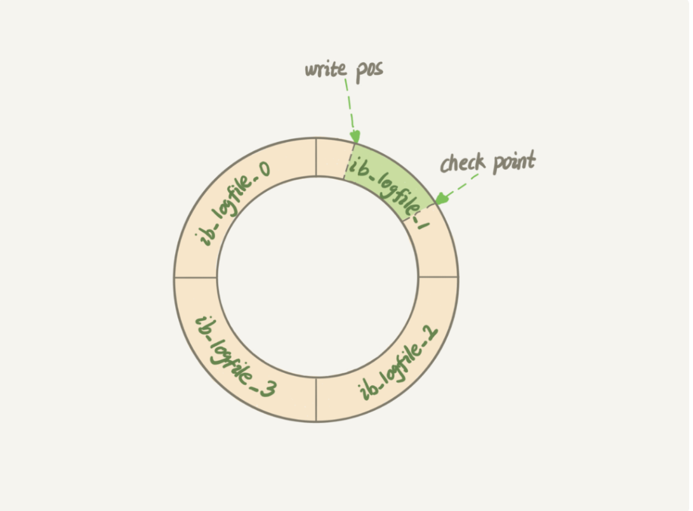

两个重要的日志模块，redo log（重做日志）和 binlog（归档日志）。

### 重要的日志模块：redo log

解决的问题

不知道你还记不记得《孔乙己》这篇文章，酒店掌柜有一个粉板，专门用来记录客人的赊账记录。如果赊账的人不多，那么他可以把顾客名和账目写在板上。但如果赊账的人多了，粉板总会有记不下的时候，这个时候掌柜一定还有一个专门记录赊账的账本。

如果有人要赊账或者还账的话，掌柜一般有两种做法：

- 一种做法是直接把账本翻出来，把这次赊的账加上去或者扣除掉；
- 另一种做法是先在粉板上记下这次的账，等打烊以后再把账本翻出来核算。

在生意红火柜台很忙时，掌柜一定会选择后者，因为前者操作实在是太麻烦了。首先，你得找到这个人的赊账总额那条记录。你想想，密密麻麻几十页，掌柜要找到那个名字，可能还得带上老花镜慢慢找，找到之后再拿出算盘计算，最后再将结果写回到账本上。

如果每一次的更新操作都需要写进磁盘，然后磁盘也要找到对应的那条记录，然后再更新，整个过程 IO 成本、查找成本都很高。为了解决这个问题，MySQL 的设计者就用了类似酒店掌柜粉板的思路来提升更新效率。MySQL 里经常说到的 WAL 技术，WAL 的全称是 Write-Ahead Logging，它的关键点就是先写日志，再写磁盘。也就是更新操作不会直接写在磁盘里，而是先记载到日志中。具体来说，当有一条记录需要更新的时候，InnoDB 引擎就会先把记录写到 redo log（粉板）里面，并更新内存，这个时候更新就算完成了。同时，InnoDB 引擎会在适当的时候，将这个操作记录更新到磁盘里面，而这个更新往往是在系统比较空闲的时候做，这就像打烊以后掌柜做的事。

如果今天赊账的不多，掌柜可以等打烊后再整理。但如果某天赊账的特别多，粉板写满了，又怎么办呢？这个时候掌柜只好放下手中的活儿，把粉板中的一部分赊账记录更新到账本中，然后把这些记录从粉板上擦掉，为记新账腾出空间。与此类似，InnoDB 的 redo log 是固定大小的，比如可以配置为一组 4 个文件，每个文件的大小是 1GB，那么这块“粉板”总共就可以记录 4GB 的操作。从头开始写，写到末尾就又回到开头循环写，如下面这个图所示。

InnoDB 引擎就会先把记录写到 redo log里面，并更新内存，这个时候更新就算完成了。同时，InnoDB 引擎会在适当的时候，将这个操作记录更新到磁盘里面。InnoDB 的 redo log 是固定大小的，比如可以配置为一组 4 个文件，每个文件的大小是 1GB，那么这块“粉板”总共就可以记录 4GB 的操作。从头开始写，写到末尾就又回到开头循环写，如下面这个图所示。

write pos 是当前记录的位置，一边写一边后移，写到第 3 号文件末尾后就回到 0 号文件开头。checkpoint 是当前要擦除的位置，也是往后推移并且循环的，擦除记录前要把记录更新到数据文件。

write pos 和 checkpoint 之间的是“粉板”上还空着的部分，可以用来记录新的操作。如果 write pos 追上 checkpoint，表示“粉板”满了，这时候不能再执行新的更新，得停下来先擦掉一些记录，把 checkpoint 推进一下。

有了 redo log，InnoDB 就可以保证即使数据库发生异常重启，之前提交的记录都不会丢失，这个能力称为 crash-safe。

## 重要的日志模块：binlog

为什么会有两份日志呢？

因为最开始 MySQL 里并没有 InnoDB 引擎。MySQL 自带的引擎是 MyISAM，但是 MyISAM 没有 crash-safe 的能力，binlog 日志只能用于归档。而 InnoDB 是另一个公司以插件形式引入 MySQL 的，既然只依靠 binlog 是没有 crash-safe 能力的，所以 InnoDB 使用另外一套日志系统——也就是 redo log 来实现 crash-safe 能力。

区别：

- redo log 是 InnoDB 引擎特有的；binlog 是 MySQL 的 Server 层实现的，所有引擎都可以使用。
- redo log 是物理日志，记录的是“在某个数据页上做了什么修改”；binlog 是逻辑日志，记录的是这个语句的原始逻辑，比如“给 ID=2 这一行的 c 字段加 1 ”。
- redo log 是循环写的，空间固定会用完；binlog 是可以追加写入的。“追加写”是指 binlog 文件写到一定大小后会切换到下一个，并不会覆盖以前的日志。

将 redo log 的写入拆成了两个步骤：prepare 和 commit，这就是"两阶段提交"。

### 两阶段提交