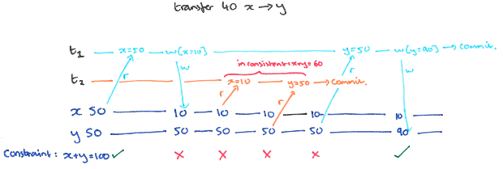

The ANSI SQL isolation levels were originally defined in prose, in terms of three specific anomalies that they were designed to prevent. 

*ANSI SQL 隔离级别最初是在散文中定义的，它们旨在防止三个特定的异常。*

#### P0: Dirty Write

两个事务同时更新同一条数据

危害：

1. 破坏数据库的一致性，假设x和y之间有一个限制，比如x==y，若按照下面这个序列执行，最终会导致x和y不一致
2. 若t2需要回滚，理论上x值应该是0

#### P1: Dirty Read

一个事务读取到了另一个正在执行中的事务已经写入的值。

假设一个转账的业务，在 t1 这个事务中从 x 账户转给 y 账户40元，在这之中，满足一个约束，即 x + y == 100，但是在 t1 执行的过程中，从 t2 的视角可能会看到 x + y == 60，会导致不一致的清醒。

#### P2: Fuzzy Read (Non-Repeatable Read)

